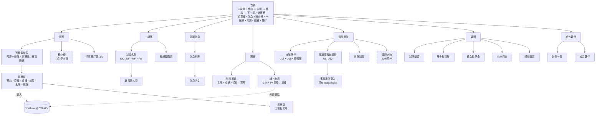

# 台中 FUTURO 官網：網站架構提案 v3

> 版本：v3｜2026-10-03（台北時間）
> 用途：交給 Claude 展開細部設定（資料表、元件、後台流程、文案）。這份文件可以單獨閱讀。
> 配套文件：
> - `futuro-benchmark.md`：12 個球團官網的實測對標和 Futuro 事實查核
> - `futuro-designs/`：首頁三版設計示意稿（A 比賽日／B 在地熱血／C 編輯極簡），**風格待業主選定**
> - [`futuro-data-requests.md`](futuro-data-requests.md)：交給 Grok-Bot 上網蒐集的資料清單（第 14 節）

## v3 修改摘要

| 類別 | 修改 |
|---|---|
| 和程式碼對齊 | 取消、延期的比賽改為公開顯示，並新增 `postponed` 狀態（5.2、8.1）；公開 RPC 回傳 `age_band`，賽程頁預設只顯示一線隊（8.1）；公開比賽名單只限一線隊（8.1）；直播結束時間改用現有的 `ends_at`，刪除 `live_window_duration_min`（5.1）；快取加 tag 才能用 `revalidateTag`（13-3） |
| 資料模型 | 新增對手隊伍、場地、賽季與賽事、輪次、肖像同意紀錄（第 8 節） |
| 比賽日體驗 | 主視覺從三種狀態增加為四種：多了「賽後」和「休賽期」（3.1）；行事曆訂閱、LINE 分享、每場自動分享圖（6.1） |
| 營運 | 新增「媒體」角色（5.6、8.1）；比賽週內容流程（7.3） |
| 商業 | 流量分析、媒體專區（6.9、第 11 節） |
| 上線 | 舊 Wix 站轉址、翻譯不齊時的處理、帳號歸屬（第 11 節） |
| 資料補齊 | 缺少的資料交給 Grok-Bot 上網蒐集，回傳格式和規則見第 14 節 |
| 事實更正 | 10/25 對手是**台中磐石**；第 1、2 輪主場在**台中西屯足球場**，10/18 主場在**太原足球場**，本季主場安排待球團確認 |

---

## 0. 背景（給第一次讀到這份文件的人）

**球團**
- 台中FUTURO（台中 Futuro FC）是「臺灣企業甲級足球聯賽」（台企甲／TFPL）的球隊。聯賽由中華民國足球協會（CTFA）主辦，2026/27 季共 8 隊，每隊 21 場。
- 2016 年由日籍前職業球員小森由貴創立，2019 年首度參加台企甲。2022 年拿下亞軍，2023–24 年首度參加亞足聯 AFC Cup。
- 2025 年 3 月與 J 聯賽大分三神簽合作備忘錄。
- 球團旗下有梯隊（CTFA 登記了 U15、U18）和基層課程（U8–U12）。

**這次要做的事**
- 球團老闆想把我們的 Squadbase 平台當作**球團官網**。
- 定位是**職業球團官網**：一線隊是主體，青訓是輔助。

**平台：Squadbase**
- 技術：Next.js 16（App Router）、TypeScript、Supabase（Postgres、RLS、RPC），以 PWA 形式部署在 Vercel。
- 多語系：next-intl，支援 zh-Hant／ja／en。
- Repo：`github.com/Victorccchen/squadbase`，staging：`squadbase-staging.vercel.app/zh-Hant`。
- 已經有的功能：比賽建立與公開（匿名 RPC `list_published_matches`）、比賽名單、從網址匯入賽程、育成理念頁，以及家長端和管理端（報名、出勤、點數等）。

**第一階段範圍**
- 只做**公開官網**。後台營運功能（報名、出勤、點數、繳費）暫時不對外開放，只在青訓頁留一個家長登入入口。

**隱私原則（硬性規定）**
- 公開頁面只能顯示姓名、背號、位置這類公開資訊。
- 不能公開：聯絡方式、身分證件、生日（除非本人同意）、能力評估、出勤、繳費、監護人資料。
- **未成年球員不做個人頁**，只放團體照和隊伍資訊。**青訓比賽不公開出賽名單**（v3 新增，見 8.1）。
- 一線隊球員的個人頁要經本人同意才公開，**同意要留下紀錄，並可以撤回**（v3 新增，見 8.2-D）。

**資料原則**
- 賽程和積分以 CTFA 官網為權威來源。
- 查不到的資訊一律寫「待球團提供」。Grok-Bot 從網路蒐集的資料一律標為「待確認」，經人工或球團確認後才能公開（第 14 節）。
- 隊徽、配色（暫定海軍藍 #002F7B、紅 #B81C22、金 #D4AB0A→#EDD886，字型 Jost）在球團核准前都是暫定。

**直播**
- 台企甲每一場比賽都由 CTFA 在 YouTube 頻道「CTFA TV」直播：https://www.youtube.com/@CTFATV
- 2026-10-03 實測：CTFA TV 的直播結束後，**同一個網址會直接變成完整重播**（例：第 1 輪「台中FUTURO vs 大同石虎」`BX5z_31ePNk`，長 2:01:25；第 2 輪「台中FUTURO vs 高雄先鋒」`2xp137k-j2c`，長 2:10:00）。
- 抽查 3 支已結束的直播，YouTube 都回報 `playableInEmbed: true`，oEmbed 回傳 200，代表**目前允許嵌入**。
- 直播進行中能不能嵌入，還要找一場真的直播再驗證一次（見第 9 節）。

---

## 1. 設計原則

1. **比賽日優先**：首屏永遠是比賽。賽前顯示下一場；比賽進行中**自動切換成直播播放器**；**賽後一段時間顯示比分和重播**，之後才換成下一場。
2. **一份資料，到處用**：比賽、比分、名單、影片網址、對手、場地都只在 Squadbase 輸入一次，首頁、賽程頁、比賽頁、積分榜共用同一份資料。
3. **讓人「看得到比賽」**：現場看（觀賽指南）和線上看（CTFA TV）都是主選單等級的入口。
4. **青訓雙軌**：梯隊（U15／U18／預備隊 → 一線隊）是球團骨幹；基層課程（U8–U12）是對外服務。招生不搶首頁。
5. **小團隊撐得住**：版型固定；比賽日只需要貼一個 YouTube 網址；照片不夠時用排版主視覺；**每週工作有固定流程**（7.3）。
6. **任何時候都有東西可看**（v3 新增）：延期、取消、休賽期、沒有照片，每種情況都有設計好的畫面，不會出現空白。

---

## 2. 主選單

**桌機主選單（7 項）**

| # | 繁中 | 日本語 | English | 子項目 |
|---|---|---|---|---|
| 1 | 比賽 | 試合 | Matches | 賽程與結果／積分榜／比賽頁／**行事曆訂閱** |
| 2 | 一線隊 | トップチーム | First Team | 球員名單／教練與職員 |
| 3 | 最新消息 | ニュース | News | 分類：戰報／球隊／青訓／在地／夥伴／公告 |
| 4 | 觀賽 | 観戦 | Watch & Visit | **到場看球**（主場與交通／觀賽須知／票務資訊）．**線上收看**（CTFA TV 直播與重播） |
| 5 | 青訓學院 | アカデミー | Academy | 梯隊路徑（U15／U18／預備隊）／基層課程與體驗（U8–U12）／出身球員／國際交流（大分三神） |
| 6 | 球團 | クラブ | Club | 球團概要／歷史與榮譽／理念與使命／在地活動／**媒體專區** |
| 7 | 合作夥伴 | パートナー | Partners | 夥伴一覽／成為夥伴 |

- **頁首右側**：語言切換（繁中／日本語／EN）、IG、FB、LINE、YouTube（Futuro 自己的頻道，**待球團提供**），以及「聯絡我們」。
- **比賽進行中**，頁首加一個紅色「● LIVE」小標，點了回到首頁播放器。
- **家長登入**只放在「青訓學院」頁和頁尾。
- **手機底部固定列**：比賽／消息／觀賽／青訓／選單。比賽進行中，「比賽」改成「● LIVE」。
- **頁尾**：營運單位、地址、聯絡方式（**待球團提供**）、全站連結、SNS、**媒體專區**、隱私權政策、照片與肖像使用說明、外部連結（CTFA、CTFA TV、大分三神）。

---

## 3. 首頁區塊順序

| # | 區塊 | 內容 | 資料來源 |
|---|---|---|---|
| 1 | 頁首 | 隊徽、主選單、語言、SNS；比賽中多一個 LIVE 小標 | site config＋比賽狀態 |
| 2 | **主視覺（會依比賽狀態切換）** | 見 3.1 | 已公開的一線隊比賽＋影片欄位 |
| 3 | 結果條 | 上一場比分（附「看重播」或「看精華」按鈕）＋接下來 3 場；**延期或取消的比賽加標示** | 已公開的比賽 |
| 4 | 最新消息 | 3–4 張卡片，附分類 | 新聞 CMS（需新做） |
| 5 | 台企甲積分榜 | 8 隊完整列出，**附對手隊徽**，Futuro 那一列反白；附「第 N 輪後・來源：CTFA」和更新日期 | 積分榜＋對手隊伍表（需新做） |
| 6 | 一線隊 | 球員輪播（背號、位置、姓名），連到全隊名單 | 名單（擴充欄位） |
| 7 | 球團標語帶 | 標語（**待球團提供**）＋三個已核實的事實：2016 創立／2019 台企甲／2023–24 AFC Cup | 靜態內容 |
| 8 | 青訓學院 | 路徑圖：基層 U8–U12 → U15 → U18 → 預備隊 → 一線隊（開設現況**待球團確認**）；按鈕「梯隊介紹」「預約體驗課」 | 現有的育成理念內容 |
| 9 | 觀賽資訊 | 左邊「到場看球」（**下一場比賽的場地**、地圖、交通），右邊「線上收看」（CTFA TV 說明與連結） | 場地表＋CTFA TV 連結 |
| 10 | 合作夥伴 | 依等級排列的 logo 牆＋「成為夥伴」 | 夥伴資料（需新做） |
| 11 | 追蹤我們 | IG、FB、LINE、YouTube，每個附一句用途 | site config |
| 12 | 頁尾 | — | — |

### 3.1 主視覺的四種狀態（v3：由三種改為四種）

| 狀態 | 什麼時候 | 主視覺顯示 |
|---|---|---|
| **A. 賽前** | 有下一場比賽，而且現在早於「開球時間 − 直播前置時間」（預設 30 分鐘） | **比賽主視覺**：雙方隊徽、對手、日期與開球時間（台北時間）、場地、主客場、賽事與輪次、倒數；按鈕「比賽資訊」「怎麼去」（連到**這場比賽的場地**）「線上收看」「加入行事曆」 |
| **B. 直播時段** | 開球前 30 分鐘到直播結束（判斷規則見 5.2） | 有直播網址而且可以嵌入：**YouTube 直播播放器**（16:9）＋對戰資訊條（雙方隊名、輪次、場地）＋「LIVE」標示＋「在 YouTube 觀看」連結。沒有網址或不能嵌入：見 5.3 的備援規則 |
| **C. 賽後**（新增） | 直播結束後到 `postMatchHeroHours`（預設 36 小時）之內 | **比分主視覺**：雙方隊徽與比分、「看重播」「看精華」「閱讀戰報」（有戰報才顯示）；角落小卡顯示下一場的日期和對手 |
| **D. 休賽期**（新增） | 沒有任何已排定的下一場比賽（季末、賽季之間、賽程尚未公布） | **球團主視覺**：最新一則置頂新聞，或「新賽季賽程即將公布」＋上季最終排名；按鈕「最新消息」「追蹤我們」 |

- 同時符合多種狀態時，優先順序是 **B → C → A → D**。例如賽後 36 小時內又遇到下一場的直播時段，顯示 B。
- 主視覺只看**一線隊**（`age_band = senior`）的比賽，梯隊的比賽不會佔用首頁。
- 下一場比賽是**延期**時：A 狀態照樣顯示，但日期改成「延期，日期待定」，倒數隱藏（5.3）。

---

## 4. 網站地圖



> 虛線框是第二階段的頁面，或第一階段先做簡化版。積分榜第一階段只放首頁小表，並連到 CTFA。場地頁第一階段可以只是觀賽頁裡的錨點區塊，每個場地一段。

---

## 5. 直播與重播嵌入規格（第一階段）

### 5.1 資料欄位（每場比賽）

放在 `match_publications`（以 `session_id` 對應 `training_sessions` 的比賽列），並從公開 RPC 回傳。理由：這張表本來就是「比賽的公開資訊」，RLS 和公開 RPC 都已經以它為準。

| 欄位 | 型別 | 說明 |
|---|---|---|
| `live_stream_url` | text, null | 管理員貼上的 CTFA TV 單場直播網址（原樣保存，方便追查） |
| `live_video_id` | text, null | 從網址解析出的 11 字元 ID，`^[A-Za-z0-9_-]{11}$` |
| `replay_url`／`replay_video_id` | text, null | 完整重播。**沒有填就沿用直播的影片 ID**，因為 CTFA 的直播結束後同一網址就是重播 |
| `highlights_url`／`highlights_video_id` | text, null | 精華（選填，CTFA 或 Futuro 自己剪的都可以） |
| `embed_enabled` | bool, 預設 true | 每場比賽的嵌入開關。關掉就只顯示「前往 YouTube 觀看」 |
| `embed_check_status` | enum: `unknown`／`ok`／`blocked`／`not_found` | 存檔時用 YouTube oEmbed 檢查的結果（見 5.4） |
| `embed_checked_at` | timestamptz, null | 上次檢查的時間 |
| `video_title` | text, null | oEmbed 回傳的影片標題，後台用來確認沒有貼錯場次 |
| `live_window_before_min` | int, null | 這場的直播前置分鐘數；null 就用全站預設 |

> v3 刪除 `live_window_duration_min`。`training_sessions.ends_at` 已經存在而且是必填，直播結束時間直接用它。建立一線隊比賽時，`ends_at` 預設為開球後 150 分鐘；遇到延長賽或延誤，管理員改 `ends_at` 就好。

**全站設定**（site settings，第一階段可以先放在 `site-config.ts`）
- `liveWindowBeforeMin = 30`
- `defaultMatchDurationMin = 150`（建立比賽時用來帶出 `ends_at`：90 分鐘＋中場 15＋傷停與延誤的緩衝 45）
- `postMatchHeroHours = 36`（賽後主視覺保留時間）
- `postMatchGraceMin = 15`（輸入比分後再保留直播播放器的分鐘數，讓賽後訪問能播完）
- `liveEmbedGlobalEnabled = true`（全站總開關：CTFA 突然禁止嵌入時，一鍵改成只顯示連結）
- `ctfaTvChannelUrl = https://www.youtube.com/@CTFATV`
- `heroAutoplayMuted = false`（預設不自動播放）

### 5.2 比賽狀態判斷

```
 公開狀態 public_status：scheduled ／ postponed（v3 新增）／ completed ／ cancelled

 時間狀態（只有 scheduled 和 completed 會計算）：

   now < kickoff − before     kickoff − before ≤ now < liveEnd     liveEnd ≤ now < liveEnd + postMatchHeroHours     之後
 ───── upcoming ─────────────────── live_window ───────────────────────────── post_match ─────────────────────── archived
```

- `kickoff` = `starts_at`；`before` = `live_window_before_min`，沒填就用全站預設 30。
- `liveEnd` = `ends_at`。如果管理員已經輸入比分（`public_status = completed`），`liveEnd` 改為「輸入比分的時間 + `postMatchGraceMin`」和 `ends_at` 兩者中**較早**的那個。
- **延期**（`postponed`）：不進入直播時段；新日期確定後，管理員改 `starts_at`、`ends_at`，並把狀態改回 `scheduled`，狀態就依新時間重新計算。
- **取消**（`cancelled`）：不顯示任何影片，賽程列表和比賽頁照樣顯示，標示「本場取消」。
- **判斷位置**：伺服器端算出當下狀態。用戶端再根據 `kickoff`、`liveEnd` 自己計時，時間一到就切換，不用重新整理頁面。
- **同一時段有多場比賽**：首頁只看一線隊；如果一線隊同一時段真的有兩場（不太可能），取開球時間最早的那場。
- **時區**：一律以 `Asia/Taipei` 顯示；日文版在時間旁加註「（台湾時間）」，避免日本訪客誤以為是日本時間。

### 5.3 各狀態要顯示什麼（含備援）

| 狀態 | 首頁主視覺 | 比賽頁的影片區 |
|---|---|---|
| upcoming | A：比賽主視覺，「線上收看」連到 CTFA TV 頻道 | 「本場將於 CTFA TV 直播」＋頻道連結；已經有直播網址就加「預約提醒」（連到 YouTube 影片頁） |
| live_window｜有網址、可嵌入、總開關開啟 | B：**嵌入直播播放器**＋LIVE 標示 | 同一個播放器 |
| live_window｜有網址，但嵌入關閉或檢查為 blocked | A 的版面＋紅色按鈕「**前往 YouTube 觀看**」（連到單場影片） | 同左 |
| live_window｜沒有網址 | A 的版面＋「**前往 CTFA TV 觀看**」（連到 `@CTFATV/streams`） | 同左 |
| live_window｜播放器載入失敗（用戶端偵測） | 改回 A 的版面＋「前往 YouTube 觀看」 | 同左 |
| post_match | C：比分主視覺＋「看重播」「看精華」 | 有精華就嵌入精華，重播放在下方或分頁；沒有精華就嵌入重播；兩者都沒有就用直播的影片 ID；都沒有就只放比分和「CTFA TV 頻道」連結 |
| archived | 不影響主視覺（顯示下一場 A，或休賽期 D） | 同 post_match |
| postponed | 若是下一場：A 的版面，日期改「延期，日期待定」，隱藏倒數 | 「本場延期，新日期公布後更新」＋CTFA 公告連結（有的話） |
| cancelled | 不佔用主視覺 | 「本場取消」，沒有影片 |

### 5.4 網址驗證與解析（管理員存檔時）

- **接受的格式**：
  - `youtube.com/watch?v=ID`（含 `m.` 和 `www.`，可以帶 `&t=`、`&si=`、`&feature=share` 等參數）
  - `youtu.be/ID`
  - `youtube.com/live/ID`
  - `youtube.com/embed/ID`
  - `youtube-nocookie.com/embed/ID`
- **拒絕並提示「請貼單場影片網址」**：頻道網址（`/@CTFATV`、`/channel/`、`/c/`）、播放清單（只有 `list=`）、`/shorts/`（精華可以考慮例外）、非 YouTube 網域。
- **只存 ID**：嵌入時由程式組出網址，**不把管理員貼的網址直接放進 iframe**，避免被注入任意網址。
- **嵌入檢查**：伺服器端呼叫 `https://www.youtube.com/oembed?url=…&format=json`。
  - 200 → `ok`，同時存下 `video_title`
  - 401 或 403 → `blocked`（不允許嵌入）
  - 404 → `not_found`（私人影片或尚未公開）
  - 檢查結果只是提示，管理員仍然可以存檔。
  - 直播開始前的「預定直播」頁，oEmbed 的行為要實測確認。
- 後台存檔後直接顯示預覽縮圖和影片標題，讓管理員確認是對的那場比賽（縮圖網址 `https://i.ytimg.com/vi/ID/hqdefault.jpg`）。

### 5.5 嵌入元件（`<MatchVideo>`）

- **隱私強化模式**：iframe 網址用 `https://www.youtube-nocookie.com/embed/{id}?rel=0&playsinline=1`（自動播放要另加 `autoplay=1&mute=1`）。
- **延遲載入**：
  - 預設是「點擊才載入」的外觀：縮圖＋播放鈕＋「YouTube」字樣，使用者點下去才插入 iframe。這樣省流量，進站時也不會先連到 Google。
  - 首頁直播時段可以選擇直接載入 iframe（`loading="lazy"`）。
- **RWD**：容器 `aspect-ratio: 16 / 9; width: 100%`，桌機主視覺最大寬度跟著版面走；iframe 加 `title`（例：「台中FUTURO vs 陽信北競 直播」）。
- **iframe 屬性**：`allow="accelerometer; autoplay; clipboard-write; encrypted-media; gyroscope; picture-in-picture; web-share"`、`allowfullscreen`、`referrerpolicy="strict-origin-when-cross-origin"`。YouTube 嵌入需要 Referer，全站不能設成 `no-referrer`。
- **CSP**（如果有設）：`frame-src https://www.youtube-nocookie.com`、`img-src https://i.ytimg.com`。
- **手機**：
  - 主視覺播放器放在最上面、全寬，對戰資訊條放在播放器下方。
  - 不自動播放有聲影片，`playsinline=1` 讓影片在頁面內播放。
  - 播放器下方固定一個「在 YouTube App 開啟」連結。
  - 底部固定列的「● LIVE」點了會捲回播放器。
- **無障礙**：播放鈕要能用鍵盤操作；LIVE 標示除了紅色也要有文字；提供「略過影片」的連結。
- **錯誤處理**：iframe 一段時間沒有載入（例如 10 秒），或收到 YouTube 的錯誤事件，就切換到備援（見 5.3）。
- **多語**：介面文字走 next-intl；影片本身是 CTFA 的中文轉播。

### 5.6 後台輸入（管理員比賽表單）

- 比賽編輯頁新增「直播與影片」區塊：直播網址、重播網址（選填，預設沿用直播）、精華網址（選填）、嵌入開關、這場的直播前置時間覆寫（進階選項）。
- 存檔時解析網址、做 oEmbed 檢查，並顯示縮圖、影片標題預覽和檢查結果。
- 比賽列表加一欄「直播網址」狀態，例如：✅ 已填／⚠️ 未填（開賽前 24 小時內）／⛔ 不允許嵌入。
- 比賽表單也要能設定：**延期**（v3）、對手（從對手隊伍表選）、場地（從場地表選）、賽季、賽事、輪次（第 8 節）。
- 「比賽日檢查清單」（第二階段）：開賽前 2 小時還沒填直播網址，就推播提醒負責人。Squadbase 已經有 Web Push 的基礎。
- **權限（v3 修改）**：新增 **`media` 角色**，給比賽日負責人和新聞負責人使用。`media` 可以編輯：比賽的影片欄位、比分、延期狀態、比賽名單（一線隊）、新聞、積分榜。**不能**看或改：學員資料、出勤、點數、繳費、現金。admin 擁有全部權限。公開 RPC 只回傳影片 ID 和狀態，不回傳檢查細節。
- **不自動爬 CTFA TV 頻道**：CTFA 每場直播都會開新網址，頻道頁的結構也可能改變。一律由人工貼上，確保不會配錯比賽。

### 5.7 風險與注意事項

| 風險 | 說明 | 對策 |
|---|---|---|
| CTFA 關閉嵌入 | 目前抽查的已結束直播都允許嵌入，但 CTFA 隨時可以改，直播中的設定也可能不同 | 每場存檔時做 oEmbed 檢查；有全站總開關；備援是「前往 YouTube 觀看」；**10/11 台電對 Futuro（15:30）直播時實測一次**；也可以發函詢問 CTFA 是否同意嵌入 |
| 觀看數和廣告收益 | 嵌入播放的觀看數和廣告都算 CTFA 的 | 對 Futuro 沒有損失，反而能帶流量給聯賽；在文案中註明「直播由 CTFA TV 提供」 |
| 轉播權 | 用的是 CTFA 自己的 YouTube 播放器，沒有自行轉播或重製，不涉及轉播權問題 | 不下載、不剪輯、不重新上傳 CTFA 的影片；精華如果要自己剪，必須先取得 CTFA 授權 |
| 網址貼錯場次 | 貼成別場比賽的影片 | 後台顯示縮圖和影片標題讓管理員確認 |
| 時間誤差 | 延賽、提早結束、加時 | 改 `ends_at` 即可；輸入比分就提早結束直播時段 |
| 颱風延期 | 10 月仍是颱風季，延期機率不低 | `postponed` 狀態（5.2）；延期公告做成新聞範本 |
| 快取延遲 | 公開比賽的快取是 60 秒 | 用戶端用時間自己切換狀態；後台存檔時用 tag 讓快取失效（13-3） |
| 隱私 | YouTube 嵌入會設定 cookie | 用 youtube-nocookie 加上點擊才載入；隱私權政策加註第三方嵌入 |
| 對手隊徽 | 使用其他球隊的隊徽 | 先確認 CTFA 或各隊是否同意；沒有同意前用隊名縮寫圓章（第 11 節） |

---

## 6. 主要頁面版型

### 6.1 比賽：賽程與結果、比賽頁
- **列表**
  - **預設只顯示一線隊**；可以依賽季、賽事篩選，青訓比賽放在「青訓」篩選裡（v3）。
  - 每列顯示：日期、星期、開球時間、輪次、主客場、**對手隊徽與隊名**、場地、比分或「未開賽」、狀態（延期、取消要顯示）。
  - 影片圖示：直播中顯示「● LIVE」，已結束顯示「▶ 重播」。
  - **行事曆訂閱**（v3）：「加入行事曆」提供 `.ics` 訂閱網址（每個賽季、每個隊伍一個），延期、改時間時訂閱的人會自動更新。每場比賽頁也提供單場 `.ics` 下載。
- **比賽頁（比賽包）**
  1. 標頭：雙方隊徽、比分或開球時間、賽事與輪次、狀態標示（未開賽／LIVE／已結束／延期／取消）。
  2. **影片區**：依 5.3 顯示直播、精華或重播；下方附「直播由 CTFA TV 提供」和 YouTube 連結。
  3. 賽前資訊：日期時間、**場地（連到這個場地的交通資訊，主場客場都有）**、賽事。
  4. 名單（**只限一線隊**）：先發與替補，只放背號和姓名（第一階段只有一張名單，先發／替補的區分在第二階段）。
  5. 賽後：戰報（連到新聞）、IG 相簿連結。
  6. **分享**（v3）：LINE、Facebook、複製連結。
  7. 第二階段：進球者與時間、紅黃牌、換人。
- **每場自動分享圖**（v3）：比賽頁的 OG 圖由程式產生，賽前顯示「雙方隊徽＋日期時間＋場地」，賽後顯示「比分」。分享到 LINE、FB 時會出現這張圖。
- **結構化資料**（v3）：比賽頁加 schema.org `SportsEvent` JSON-LD（主客隊、時間、場地、狀態），讓搜尋結果能顯示比賽資訊。
- 2026/27 的 21 場賽程已經在 CTFA 公布，上線時就能全部放上（Grok-Bot 蒐集，見第 14 節）。

### 6.2 一線隊：球員名單、個人頁
- **名單**：依 GK／DF／MF／FW 分組，卡片顯示照片（沒有就用剪影）、背號、三語姓名、位置。
- **個人頁**（只限成年一線隊球員，須本人同意，並有同意紀錄）
  - 背號、三語姓名、位置、國籍或出身地、前所屬球隊、加入年份、一句話介紹、相關新聞。
  - 生日、身高、慣用腳是選填，要經本人同意才公開。
  - 第二階段：本季出賽與進球。
- **不公開**：聯絡方式、證件、能力評估、出勤、繳費、監護人資料。
- **球員撤回同意**：個人頁立即下架，名單只留背號、姓名、位置（v3）。
- **教練與職員**：照片、姓名、職稱、經歷。
- **結構化資料**：球隊頁加 schema.org `SportsTeam`。

### 6.3 最新消息
- 列表（分類篩選）＋內文（標題、日期、封面、內文、相關比賽或球員）。
- 內文可以嵌入 YouTube，用同一個 `<MatchVideo>` 元件。
- 最少只要「標題＋三句話＋一張圖」就能發；繁中必填，日文和英文選填。
- **範本**（v3）：賽前預告、戰報、延期公告、新球員加盟，四種範本讓小編填空即可（7.3）。
- **分享**：LINE、Facebook、複製連結。
- 照片欄位要有**攝影者署名**（v3）。

### 6.4 觀賽
- **到場看球**
  - **場地**（v3：主場與客場都列，每個場地一段）：場名、地址、地圖、公車、開車與停車、無障礙設施。Futuro 本季的主場是西屯、太原，還是兩處輪流，**待球團確認**；各場地的公開資訊由 Grok-Bot 蒐集（第 14 節）。
  - 觀賽須知：是否收費、入場方式、座位、可攜帶物品、親子、客隊球迷（**待球團提供**）。
  - 票務資訊：是否售票、在哪裡買（**待球團提供**）。
- **線上收看**
  - 說明：台企甲每場比賽都由 CTFA TV 在 YouTube 直播。
  - 頻道連結：https://www.youtube.com/@CTFATV
  - 本季 Futuro 的直播與重播列表：從比賽資料自動產生，每場一列，附「看直播」或「看重播」。
  - 小提醒：「比賽當天首頁會直接播放直播」。

### 6.5 青訓學院
- **梯隊路徑**：U15、U18、預備隊（年齡、理念、參加的賽事、選拔方式），只放團體照。
- **基層課程與體驗**：沿用 staging 的育成理念內容（U-8／U-10–12／U-13–15／U-16–18 和能力圖表），加上時段、地點、費用（**待球團提供**）和體驗課報名入口。
- **出身球員**、**國際交流**（大分三神）：第二階段。
- 家長專區登入：連到現有的 Squadbase app。
- 青訓比賽：可以公開賽程和比分，**不公開出賽名單**。

### 6.6 球團
**球團概要**（參考 J 聯賽的「クラブ概要」資料表）

| 欄位 | 內容 |
|---|---|
| 球團名稱 | 台中FUTURO（CTFA 名稱）；日文和英文的正式寫法**待球團提供** |
| 隊名由來 | 「Futuro」是西班牙語的「未來」 |
| 創立／創辦人 | 2016 年／小森由貴 |
| 代表人、營運單位、練習場 | **待球團提供**（營運單位有一個來源寫「臺中市足球未來發展協會」，需確認） |
| 主場城市／主場球場 | 台中市／**待確認**（西屯足球場或太原足球場） |
| 球隊顏色、隊徽說明 | **待球團提供** |
| 所屬聯賽 | 臺灣企業甲級足球聯賽 |
| 官方 SNS | IG @futuro.football、FB FUTURO.TAIWAN；LINE 和 YouTube **待球團提供** |

**歷史與榮譽**（只放已核實的事實，Grok-Bot 補來源，見第 14 節）
- 2016 創立
- 2018 成立成人隊，通過台企甲資格賽
- 2019 首季台企甲
- 2020、2021 季軍
- 2022 亞軍（10 勝 7 和 1 負，16 場不敗）
- 2023–24 AFC Cup，打進淘汰賽
- 2025 年 3 月與大分三神簽合作備忘錄
- 2025/26 第 4 名，參加 AFC Challenge League 資格賽
- 2026 年 U16 健身工廠盃冠軍

**理念與使命**：沿用現有 Wix 站和 staging 的使命文字，需球團確認。

**在地活動**：第二階段。

### 6.7 合作夥伴
- 等級名稱和權益**待球團提供**。預設欄位：主贊助／官方夥伴／支持企業／在地夥伴／學院夥伴。
- 每個夥伴有 logo、名稱、連結、等級。
- 「成為夥伴」：一段說明＋聯絡方式＋**官網流量概況**（v3：用第 11 節的流量分析數字，例如每月造訪數、比賽日直播觀看人次，作為招商依據）。
- 夥伴 logo 的點擊次數要記錄，作為給贊助商的成效報告。

### 6.8 聯絡
- 一般聯絡、媒體、合作、青訓；email 和 LINE（**待球團提供**）。

### 6.9 媒體專區（v3 新增）
- 隊徽下載（彩色、單色、反白）與使用規範。
- 官方照片的使用規範與署名方式。
- 媒體窗口（**待球團提供**）。
- 最新新聞稿列表（新聞分類「公告」）。
- 第一階段做成一頁靜態內容即可。

---

## 7. 內容提供與比賽日分工

### 7.1 球團必須提供的內容

**A. 上線前必備**
1. 隊徽、配色、字型的核准；**三版設計風格選定**
2. 中日英正式名稱；網域
3. 一線隊 2026/27 名單（背號、三語姓名、位置），以及每位球員是否同意公開（**簽署同意書**）；照片（選填）
4. 教練與職員名單
5. 本季主場、入場方式、是否售票（場地地址與交通由 Grok-Bot 先蒐集，球團確認）
6. 代表人、營運單位、練習場
7. SNS 清單（LINE、YouTube）
8. 聯絡窗口（一般、媒體、合作、青訓）
9. 主視覺照片 3–5 張（沒有也能上線）
10. 梯隊實際開設的情況
11. **指定「比賽日負責人」和「新聞負責人」**，各開一個 `media` 帳號
12. 網域、Vercel、Supabase 等帳號的歸屬（第 11 節）

**B. 上線後一個月內**：贊助商與等級、標語和創辦人的一段話、課程時段與費用、梯隊團體照、新聞更新頻率、媒體專區的隊徽檔案。

**C. 第二階段**：出身球員名單和本人同意、大分三神交流紀錄、在地活動、逐場進球與紅黃牌、日英翻譯校對者。

### 7.2 比賽日流程（誰貼網址）

| 時間點 | 動作 | 負責人 |
|---|---|---|
| 賽前 1–3 天（CTFA 建好預定直播時） | 到 CTFA TV 找到這場的直播頁，把網址貼進比賽的「直播網址」；確認縮圖和標題正確，檢查結果顯示 ok | 比賽日負責人（上線初期可以由我們代為處理） |
| 賽前 2 小時 | 確認後台這場顯示 ✅；還沒填就去 CTFA TV 的直播頁找 | 同上 |
| 開球前 30 分鐘 | 首頁自動切換成播放器，不需要任何操作；有空可以開首頁確認一下 | 自動 |
| 比賽結束 | 在後台輸入比分（現有功能），首頁自動切成賽後比分主視覺 | 同上 |
| 賽後 24 小時內（選填） | CTFA 或 Futuro 有精華影片就貼「精華網址」；戰報新聞貼 IG 連結 | 同上或新聞負責人 |
| 出狀況時 | CTFA 不允許嵌入 → 把這場的嵌入開關關掉，或關掉全站總開關。比賽延期 → 改成 `postponed`，發延期公告 | 管理員或比賽日負責人 |

> CTFA 預定直播頁通常多早建好，還沒確認，要觀察幾輪才知道。

### 7.3 比賽週內容流程（v3 新增）

以週日比賽為例。目標是一週固定 4 則內容，小團隊也能維持。

| 時間 | 內容 | 範本 | 負責人 |
|---|---|---|---|
| 賽前 3 天（週四） | 賽前預告：對手近況、上次交手結果、觀賽方式 | 賽前預告 | 新聞負責人 |
| 賽前 1–3 天 | 貼直播網址（7.2） | — | 比賽日負責人 |
| 比賽當天 | 首頁自動直播；IG 限時動態導流到官網 | — | 自動／小編 |
| 賽後 2 小時內 | 輸入比分；首頁自動切到比分主視覺 | — | 比賽日負責人 |
| 賽後 24 小時內 | 戰報：比分、進球、三句話重點、一張照片、重播連結 | 戰報 | 新聞負責人 |
| 每輪結束後 | 更新積分榜（第 N 輪後） | — | 比賽日負責人 |

---

## 8. 資料模型與 Squadbase 支援對照

對照的是 repo `main`（3a51e95，2026-10-02）和 staging。

### 8.1 現有程式碼要修改的地方（v3 新增）

| 問題 | 現況（程式碼位置） | 修改 |
|---|---|---|
| 取消、延期的比賽看不到 | `match_is_publicly_visible` 只放行 `public_status in ('scheduled','completed')`（`20260909010000_stage6p1_friendly_matches.sql`） | `match_public_status` 新增 `postponed`；可見條件改為 `scheduled`、`postponed`、`completed`、`cancelled` 都公開（仍需 `is_published = true`、未軟刪除）；影片欄位只在 `scheduled`、`completed` 回傳 |
| 延期日期未定 | `training_sessions.starts_at` 必填 | 延期時保留原日期，靠 `postponed` 狀態把日期顯示為「待定」；新日期公布後再改 |
| 無法判斷是不是一線隊 | `list_published_matches` 沒有回傳 `age_band`；友誼賽也會公開 | `list_published_matches`、`get_published_match` 加回傳 `age_band`（以及第 8.2 新增的欄位）；賽程頁預設只顯示 `senior` |
| 青訓比賽名單公開了未成年姓名 | `list_published_match_roster` 對任何已公開的比賽都回傳姓名和背號 | 只對 `age_band in ('senior','reserve')` 的比賽回傳名單；其他回傳空集合。預備隊若有未成年球員，個別排除（待確認） |
| 直播結束時間 | v2 打算新增 `live_window_duration_min` | 改用現有的 `training_sessions.ends_at`（必填），不新增欄位 |
| 快取無法依存檔失效 | `lib/site/portal-match-query.ts` 的 `unstable_cache` 沒有 tag，只靠 60 秒到期 | 加上 tag（例如 `published-matches`），後台存檔時讓這個 tag 失效。Next 16 的快取 API 有變，實作前先讀 `node_modules/next/dist/docs/` 的快取章節 |
| 權限太粗 | 比賽和新聞的編輯只有 admin | `app_role` 新增 `media`（5.6） |

### 8.2 要新增的資料（v3 新增）

**A. 對手隊伍 `clubs`**（台企甲 8 隊，含 Futuro 自己）

| 欄位 | 說明 |
|---|---|
| `id`、`slug` | |
| `name_zh`、`name_ja`、`name_en` | 三語正式名稱 |
| `short_zh`、`short_en` | 簡稱（例：台電、Taipower），用在結果條和積分榜 |
| `crest_path` | 隊徽（公開 bucket）；**使用許可待確認**，沒有許可前顯示縮寫圓章 |
| `crest_permission` | enum：`unknown`／`granted`／`denied` |
| `home_venue_id` | 主場 |
| `website_url`、`instagram_url`、`facebook_url` | 選填 |
| `is_self` | 是不是 Futuro 自己 |

`match_publications` 新增 `opponent_club_id`（null 時沿用現有的 `opponent` 文字，相容友誼賽和青訓比賽）。

**B. 場地 `venues`**

| 欄位 | 說明 |
|---|---|
| `name_zh`、`name_ja`、`name_en` | |
| `address_zh`、`address_en` | |
| `lat`、`lng`、`map_url` | |
| `transit_zh`、`parking_zh`（日英選填） | 公車、捷運、停車 |
| `accessibility_zh` | 無障礙設施 |
| `capacity`、`surface` | 選填（人工草或天然草） |

`training_sessions.location` 是自由文字，保留；比賽新增 `venue_id`，有值時以 `venue_id` 為準。

**C. 賽季與賽事**

| 表 | 欄位 |
|---|---|
| `seasons` | `label`（例：2026/27）、`starts_on`、`ends_on`、`is_current` |
| `competitions` | `name_zh`、`name_ja`、`name_en`、`short`、`kind`（league／cup／continental／friendly）、`organizer`（CTFA、AFC 等） |
| `match_publications` 新增 | `season_id`、`competition_id`、`round_label`（例：第 3 輪；盃賽可以是「八強」） |

**D. 肖像同意紀錄 `publicity_consents`**

| 欄位 | 說明 |
|---|---|
| `person_type`、`person_id` | 球員或教練 |
| `scope` | 可以多選：姓名與背號、照片、個人頁、生日、身高、慣用腳 |
| `granted_at`、`granted_by` | 誰在什麼時候登記 |
| `document_path` | 同意書掃描檔（**私有** bucket） |
| `revoked_at` | 撤回時間；撤回後公開 RPC 立刻不再回傳對應欄位 |

公開 RPC 只回傳「有效同意範圍內」的欄位；未成年球員一律不回傳個人資料，不論是否同意。

**E. 積分榜 `standings`**

| 欄位 | 說明 |
|---|---|
| `season_id`、`competition_id`、`after_round` | 第幾輪後 |
| `club_id`、`position`、`played`、`won`、`drawn`、`lost`、`goals_for`、`goals_against`、`points` | |
| `source_url`、`fetched_at` | 來源與時間（顯示「來源：CTFA」和更新日期） |

第一階段人工輸入或由 Grok-Bot 整理後匯入；第二階段再評估從 CTFA 排名頁匯入。

**F. 新聞 `news_posts`、夥伴 `partners`、夥伴點擊 `partner_clicks`**：細節見 13-10。

### 8.3 第一階段支援對照

| 第一階段項目 | 現況 | 判定 |
|---|---|---|
| 賽程與結果（列表與詳情） | 已有 `/[locale]/matches`、`/[locale]/matches/[id]`，資料來自匿名 RPC `list_published_matches` | ✅ 已支援（要加一線隊篩選，8.1） |
| 比賽欄位 | 對手、主客場、地點、開球時間、比分、狀態、備註、賽事類型 | ⚠️ 要加對手、場地、賽季、賽事、輪次、延期（8.2） |
| 從網址匯入賽程 | 匯入面板接受任何公開網址，Torneopal 有快速解析 | ⚠️ CTFA 頁面還沒實測；Grok-Bot 的賽程資料可作為備案 |
| 首頁「下一場、上一場」 | `listPortalMatchHighlights` | ✅ 已支援（版面要重做；要加四種主視覺狀態） |
| 公開比賽名單 | `list_published_match_roster`：只回傳姓名和背號 | ⚠️ 要限制只回傳一線隊（8.1） |
| 一線隊作為一支隊伍 | `teams.age_band` 可以設 `senior`／`reserve` | ✅ 模型可行（還沒建資料） |
| **比賽影片欄位** | 不存在 | ❌ **需新做**（5.1） |
| **後台影片輸入** | 不存在 | ❌ **需新做**（5.6） |
| **嵌入元件與狀態判斷** | 不存在 | ❌ **需新做**：`<MatchVideo>`、`getMatchBroadcastState`（附測試）、四種主視覺、用戶端計時、LIVE 小標和底部列狀態 |
| 全站直播設定 | `site-config.ts` 有品牌設定，沒有直播設定 | ⚠️ 加常數就能先用 |
| 對手、場地、賽季、賽事、積分榜 | 不存在 | ❌ 需新做（8.2） |
| 公開一線隊名單頁、球員個人頁 | 不存在；`players` 沒有位置、國籍、簡介欄位，照片是私有存放 | ❌ 需新做（含同意紀錄，8.2-D） |
| `media` 角色 | 不存在 | ❌ 需新做 |
| 多語系 | next-intl zh-Hant／ja／en、hreflang、語言切換 | ✅ 已支援（內容的多語需要 CMS 欄位；翻譯不齊的處理見第 11 節） |
| 育成理念、發展路徑 | staging 已有 | ✅ 已支援（要移到青訓頁） |
| 品牌設定 | `site-config.ts`，SNS 和地圖連結目前是 null | ⚠️ 部分支援（要改程式碼） |
| 新聞 CMS | 首頁新聞是寫死的範例資料 | ❌ 需新做 |
| 合作夥伴 | 不存在 | ❌ 需新做 |
| 觀賽、球團、歷史、媒體專區等靜態頁 | 沒有頁面路由 | ⚠️ 需新做頁面（內容先放 messages 或 MDX） |
| 行事曆訂閱、分享圖、JSON-LD | 不存在 | ❌ 需新做 |
| 教練公開資料 | 有 `coaches` 表，首頁教練區是靜態內容 | ⚠️ 需要公開欄位和 RPC |
| 比賽前提醒推播 | 已有 Web Push 基礎（staging 還在補 migration） | ⚠️ 第二階段可以沿用 |
| 家長專區 | 已完整存在 | ✅ 只留連結入口 |

---

## 9. 驗證事項（上線前）

1. **直播中的嵌入**：10/11（日）15:30 台灣電力對台中FUTURO（楠梓足球場，客場），CTFA TV 一樣會直播。直播時用測試頁嵌入，確認播放正常，並用 oEmbed 檢查。
2. **預定直播頁**：CTFA 多早建好預定直播的網址？預定狀態下 oEmbed 和嵌入的行為如何？
3. **重播網址**：直播結束後，同一個 ID 是否立刻就能播重播？（已結束的場次確認可以，剛結束的那幾分鐘還沒觀察）
4. **CTFA 是否另外上傳精華**：決定 `highlights_url` 的實際來源。
5. 如果 CTFA 將來關閉嵌入：是否需要發函取得書面同意？
6. **CTFA 的延期公告方式**（v3）：延期通常在哪裡公告、多早公告？
7. **行事曆訂閱**（v3）：iPhone 行事曆、Google 日曆訂閱 `.ics` 後，改時間是否會同步更新。
8. **分享圖**（v3）：在 LINE、Facebook 貼比賽頁網址，預覽圖是否正確。

---

## 10. 分階段上線

### 第 0 階段：確認與蒐集（約 1–2 週）
- 球團選定設計風格、核准品牌、確認主場和梯隊、提供名單並簽同意書、指定比賽日與新聞負責人。
- **Grok-Bot 蒐集第 14 節的資料**，人工核對後匯入（標記來源）。
- 測試 CTFA 賽程能不能用網址匯入；把 2026/27 的 21 場比賽建成已公開的比賽。
- **10/11 實測直播嵌入**（第 9 節）。
- 確認帳號歸屬、網域。

### 第 1 階段：MVP 官網
- 首頁 12 個區塊（含**主視覺四種狀態**）
- 比賽：賽程與結果（一線隊預設、延期與取消顯示）、比賽頁（**影片區**、名單、戰報連結、分享）、行事曆訂閱
- **影片欄位、後台輸入、嵌入元件、狀態判斷、全站總開關**
- **8.1 的程式碼修改**；對手、場地、賽季、賽事、輪次、積分榜資料表
- `media` 角色
- 一線隊：名單、個人頁（只放同意公開的欄位，含同意紀錄）、教練與職員
- 最新消息（簡易 CMS＋四種範本）
- 觀賽：到場看球（主客場場地）、**線上收看（CTFA TV）**
- 球團：概要、歷史與榮譽、理念、媒體專區
- 青訓學院：梯隊路徑、基層課程、家長入口
- 合作夥伴：logo 牆＋成為夥伴＋點擊紀錄
- 首頁 8 隊積分榜（人工更新）
- 繁中全站；日文和英文做關鍵頁
- 手機底部固定列（含 LIVE 狀態）；SEO、每場分享圖、JSON-LD
- 流量分析；舊 Wix 站轉址

### 第 2 階段：上線後 1–3 個月
- 比賽事件、先發與替補、球員本季數據、完整積分榜頁
- 比賽日推播提醒（開賽前通知、直播網址未填的提醒）
- 出身球員、大分三神專區、在地活動
- 新聞的日英翻譯流程；夥伴後台；site settings 後台化
- 精華自動彙整（「本季精華」列表）
- LINE 官方帳號整合
- 給贊助商的月報（流量與 logo 點擊）

### 之後或不做
- 自建票務和電商、付費會員或影音、自建 App、機器翻譯外掛
- 自動爬 CTFA TV 頻道（第 5.6 節的決定）
- 下載或重新上傳 CTFA 的影片
- 未成年球員個人頁、青訓比賽公開名單（永遠不做）

---

## 11. 上線與營運（v3 新增）

| 項目 | 規格 |
|---|---|
| **流量分析** | 第一階段就裝，選不需要 cookie 同意視窗的工具（例如 Vercel Web Analytics）。要看的數字：每月造訪數、比賽日造訪數、直播播放次數、夥伴 logo 點擊、各語言造訪比例。每月整理一次給老闆和贊助商 |
| **舊 Wix 站轉址** | 上線前列出 Wix 站所有網址（Grok-Bot 蒐集，第 14 節），每一個對應到新站的頁面，做 301 轉址；網域移轉後在 Google Search Console 登錄新站並提交 sitemap |
| **翻譯不齊** | 日文或英文沒有翻譯的內容：顯示繁中原文，上方加一行「本頁尚未提供日本語／English 版本」。這種頁面**不宣告**該語言的 hreflang，也不列入該語言的 sitemap，避免被搜尋引擎當成重複內容 |
| **SEO 基本** | sitemap.xml、robots.txt、每頁 title 和 description、OG 圖、JSON-LD（`SportsTeam`、`SportsEvent`、`NewsArticle`） |
| **帳號歸屬** | 網域、Vercel、Supabase、Google Search Console、流量分析，都用**球團的帳號**開，我們以協作者身分管理。合作結束時網站仍屬於球團 |
| **費用與維護範圍** | 建置費＋每月維護費；維護費寫清楚包含什麼（內容更新次數、問題回應時間、主機費是否包含） |
| **對手隊徽許可** | 向 CTFA 或各隊確認能否在官網使用隊徽；沒有許可前用縮寫圓章 |
| **效能** | 圖片一律經過 Next.js 圖片最佳化；首頁在手機 4G 下 LCP 目標 2.5 秒內 |
| **帳號安全** | admin 和 media 帳號都要開兩步驟驗證（若 Supabase Auth 設定可行）；離職人員當天停用 |

---

## 12. 待決事項（問球團）
1. **三版設計風格選哪一版**（A 比賽日／B 在地熱血／C 編輯極簡）
2. 本季主場：西屯、太原，還是兩處輪流？
3. 梯隊實際開設哪些隊？（staging 寫「U13 以後尚未開隊」，和 CTFA 登記的 U15、U18 以及 2026 年 U16 冠軍不一致）
4. 預備隊是否有未成年球員？（決定預備隊比賽能不能公開名單）
5. 主場比賽收不收費？在哪裡售票？
6. 誰負責新聞？誰是比賽日負責人？
7. 網域，以及現有的 Wix 站要不要轉址？
8. 網域、Vercel、Supabase 帳號用誰的名義開？
9. 要不要和大分三神互放連結？
10. Futuro 有沒有自己的 YouTube 頻道，或有沒有自製精華？
11. 球員肖像同意書由誰準備、誰保管？

---

## 13. 給 Claude 的待展開問題

1. **Schema**：依 5.1 和第 8 節，提出 migration（影片欄位、`postponed`、`clubs`、`venues`、`seasons`、`competitions`、`standings`、`publicity_consents`、`media` 角色）、RLS、RPC 修改（`match_is_publicly_visible`、`list_published_matches`、`get_published_match`、`list_published_match_roster`），以及 `database.types.ts` 的更新。
2. **狀態判斷函式**：寫出 `getMatchBroadcastState(match, now, settings)` 的完整規格和測試案例，包括：upcoming、live_window、post_match、archived、postponed、cancelled、輸入比分後的緩衝、`ends_at` 被延長、跨日、時區（Asia/Taipei）、同時段兩場比賽、休賽期（沒有下一場）。另寫 `getHomeHeroState(matches, now, settings)` 決定首頁四種主視覺。
3. **快取策略**：先讀 Next 16 文件確認 `unstable_cache` 和新快取 API 的現況；公開比賽的快取加 tag，存檔時讓 tag 失效；直播時段是否需要縮短快取；用戶端計時切換要怎麼避免 hydration mismatch。
4. **`<MatchVideo>` 元件 API**：props（videoId、mode: live／replay／highlights、title、autoload、onError）、點擊才載入的外觀、錯誤偵測方式（是否使用 YouTube IFrame API 的 onError，或只用 timeout）、無障礙規格。
5. **網址解析器**：完整的接受和拒絕清單，含測試案例（`si=`、`t=`、`feature=share`、`m.youtube.com`、`/live/`、`/shorts/`、帶 `list=` 的網址）；oEmbed 檢查要放在 Server Action 還是 API route，以及 timeout 和重試設定。
6. **後台 UX**：「直播與影片」區塊的版面、驗證訊息文案（三語）、縮圖與標題預覽、比賽列表的狀態欄、延期操作、對手與場地選擇器、批次貼網址的需求。
7. **首頁主視覺**：四種狀態的桌機和手機版面規格（播放器、對戰資訊條、比分、LIVE 標示、CTA），沒有照片時的排版主視覺。**等球團選定風格後再展開**。
8. **安全與隱私**：CSP、Referrer-Policy 的設定（YouTube 嵌入需要 Referer），隱私權政策要加的第三方嵌入與流量分析文字，`media` 角色的 RLS。
9. **一線隊公開名單**：`players` 要新增哪些公開欄位（位置、國籍、前所屬隊、簡介、公開照片路徑）；公開 RPC 怎麼結合 `publicity_consents`，確保未成年和沒有同意（或已撤回）的球員不會出現。
10. **新聞 CMS 和夥伴資料表**：最小可行的 schema、三語欄位策略、四種新聞範本、攝影者署名、圖片存放（Supabase Storage 的公開 bucket）、後台編輯頁、夥伴點擊紀錄。
11. **積分榜**：人工輸入的後台畫面，以及匯入 Grok-Bot 整理好的 CSV（第 14 節格式）的流程。
12. **行事曆與分享**：`.ics` 訂閱路由（每個賽季、隊伍）、UID 規則（讓改時間能同步）、每場 OG 圖的版面、JSON-LD 範例。
13. **資料匯入**：把 Grok-Bot 交回的 CSV（對手、場地、賽程、積分榜）匯入的腳本或後台頁，含「待確認」標記和來源欄位。
14. **測試計畫**：10/11 實測直播嵌入的步驟清單，以及 Playwright e2e 要涵蓋的範圍（四種主視覺、延期、取消、備援、手機、三語）。

---

## 14. 交給 Grok-Bot 的資料蒐集

網路上查得到、但目前缺少的資料，交給 Grok-Bot 蒐集。完整的任務清單、欄位格式和規則在 [`futuro-data-requests.md`](futuro-data-requests.md)，可以直接整份交給 Grok-Bot。

摘要：

| # | 資料 | 用在哪裡 |
|---|---|---|
| G1 | 台企甲 2026/27 八隊資料（三語名稱、簡稱、隊徽網址、主場、官網與 SNS） | 對手隊伍表、積分榜、對戰卡 |
| G2 | 台企甲各隊主場的場地資料（地址、座標、交通、停車、無障礙） | 場地表、觀賽頁、「怎麼去」 |
| G3 | Futuro 2026/27 全部 21 場賽程（輪次、日期、開球、主客、場地） | 賽程頁、行事曆 |
| G4 | 台企甲 2026/27 每輪結束後的積分榜 | 積分榜 |
| G5 | Futuro 2026/27 比賽的 CTFA TV 影片網址 | 影片欄位（已結束場次） |
| G6 | Futuro 參加過的賽事清單 | 賽事表 |
| G7 | 歷史與榮譽每一條的來源 | 歷史頁 |
| G8 | 一線隊 2026/27 公開登錄名單（只限成年球員）和教練團 | 名單草稿，**球團確認並簽同意書後才公開** |
| G9 | Futuro 所有官方帳號與舊 Wix 站網址清單 | 頁尾、轉址 |
| G10 | 台企甲比賽規則：同分排名規則、延期公告方式、門票政策 | 積分榜說明、延期流程、觀賽須知 |

Grok-Bot 交回的資料一律標為「待確認」，**不能直接公開**，要經人工核對來源、球團確認後才能匯入公開資料。

---

## 15. 參考
- 對標研究與事實查核：`futuro-benchmark.md`
- 設計示意稿：`futuro-designs/`（`compare.png` 為三版並排比較）
- CTFA Futuro 賽程：https://www.ctfa.com.tw/2026-a/teamplan/67-tfpl2026/252-futuro.html
- CTFA TV：https://www.youtube.com/@CTFATV（2026-10-03 抽查 3 支已結束直播：`playableInEmbed: true`、oEmbed 200）
- 資料蒐集任務：[`futuro-data-requests.md`](futuro-data-requests.md)
