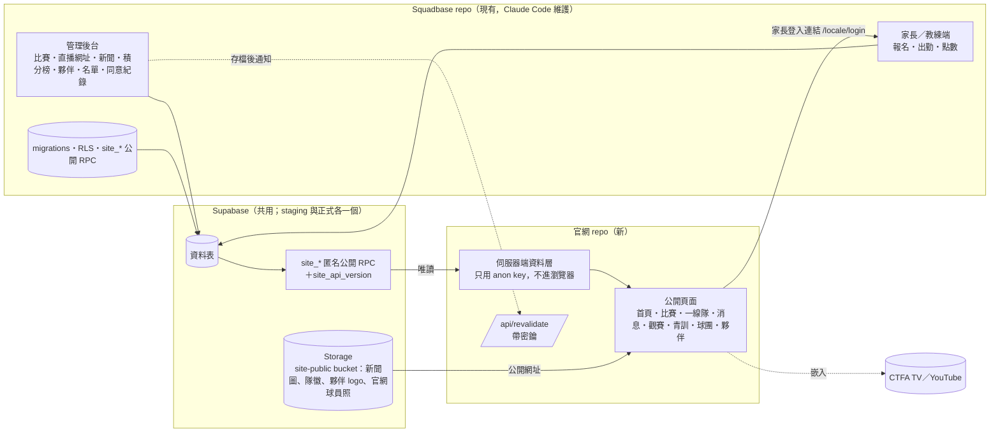
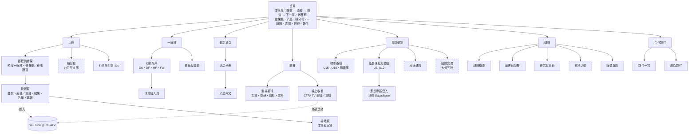

# 台中 FUTURO 官網：網站架構提案 v4

> 版本：v4｜2026-10-03（台北時間）｜Claude v3（修訂版）加上 Grok 的程式碼查核與優化
> 用途：交給 Claude Code 展開細部設定並實作（資料表、元件、後台流程、文案）。這份文件可以單獨閱讀。
> 分工（2026-10-03 Victor 決定）：**Claude Code 是唯一修改程式碼、開 PR 的窗口**；Grok 負責研究、架構、品牌與設計，不改 repo。
> 配套文件：
> - `futuro-benchmark.md`：12 個球團官網的實測對標和 Futuro 事實查核
> - `futuro-designs/`：首頁三版設計示意稿（A 比賽日／B 在地熱血／C 編輯極簡），**風格待業主選定**
> - `futuro-v3-review.md`：v3 逐節審查、程式碼查核和判定表（本文件的依據）
> - [`futuro-data-requests.md`](futuro-data-requests.md)：交給 Grok-Bot 上網蒐集的資料清單（第 14 節）
> 查核基準：Squadbase repo `main` @ `3a51e95`（2026-10-02 21:33 台北時間）

## v4 相對 v3 的調整

| # | 類別 | v3 | v4 | 位置 |
|---|---|---|---|---|
| 1 | 程式碼更正 | 賽程頁沿用 `list_published_matches` | 這支 RPC **只回傳最近 90 天以後的比賽**（`starts_at >= now() - 90 days`），整季賽程會缺。改用新的 `site_list_matches(p_season_id, …)` | 8.1、13-A2 |
| 2 | 程式碼更正 | 可見條件加上 `cancelled` 就能公開取消的比賽 | `admin_cancel_match` 會把 `is_published` 設成 false。要一起改取消和還原的 RPC，取消後保持公開 | 5.2、8.1 |
| 3 | 程式碼更正 | 直播結束時間直接用 `ends_at` | 目前建立比賽的預設長度是 **90 分鐘**（`DEFAULT_MATCH_DURATION_MINUTES = 90`）。狀態判斷改用 `scheduledEnd = max(ends_at, kickoff + 150 分)`；一線隊預設 150 分並回填 | 5.1、5.2、8.1 |
| 4 | 程式碼更正 | 新增 `venues` 表，比賽新增 `venue_id` | `venues` 和 `training_sessions.venue_id` **已經存在**，用於 QR 報到和人數任務。改成新表 `public_venues`，比賽用 `match_publications.public_venue_id` | 8.2-B |
| 5 | 程式碼更正 | 輸入比分後保留 15 分鐘 | 現有資料表沒有記錄輸入比分的時間。新增 `result_entered_at` | 5.1、5.2 |
| 6 | 程式碼補充 | 預備隊未成年待確認 | 預備隊預設只收成年球員，但可以覆寫。名單 RPC 再加上依比賽日年齡過濾 | 8.1 |
| 7 | 程式碼補充 | 新增 `postponed`、`media` | 新增 enum 值要放在獨立的 migration；`media` 不含名單編輯 | 5.6、8.1 |
| 8 | 隱私 | — | 現有的 `list_published_match_roster` 會公開 U8–U12 比賽的姓名。**建議不等官網，先修** | 8.1、12-V |
| 9 | 系統架構 | 只寫了原則 | 補上：正式環境 Supabase（目前沒有）、`site_*` 公開 API 合約與版本、anon 權限稽核、官網只在伺服器端讀資料、Next 16 快取失效寫法、PWA `start_url`、網域與登入連結 | 系統架構 |
| 10 | 主視覺 | 四種狀態 | 補「比賽結束但還沒輸入比分」的畫面 | 3.1、5.3 |
| 11 | 範圍 | 第 1 階段一次做完 | 拆成 **1a 上線必備**和 **1b 上線後 4 週內**；`partner_clicks` 不做，改用 UTM 加分析事件 | 6.7、10 |
| 12 | 營運 | 每週固定 4 則 | 2 則必做加 2 則選做 | 7.3 |
| 13 | 營運 | Vercel Analytics、Wix 301 | Vercel 商用要 Pro；只有 `wixsite.com` 子網域時沒辦法做 301 | 11 |
| 14 | SEO | `SportsTeam`、`SportsEvent`、`NewsArticle` | 補 `eventStatus` 對應、`VideoObject`、`BreadcrumbList`、`sameAs`、`x-default`、canonical 規則 | 11.1 |
| 15 | 品牌與 UX | — | 新增品牌與照片規範、無障礙（品牌色對比實測）、效能 | 11.2–11.4 |
| 16 | 事實 | — | 第 1 輪重播 `BX5z_31ePNk`、第 2 輪重播 `2xp137k-j2c`；10/11 客場對台電（15:30）；10/18 主場對陽信北競（16:00，太原）；10/25 客場對**台中磐石**（19:00，台中西屯足球場）；本季主場是西屯還是太原**待球團確認** | 0、9 |

<details>
<summary>沿用的 v3 修改摘要（已全部併入本文件）</summary>

| 類別 | 修改 |
|---|---|
| 和程式碼對齊 | 取消、延期的比賽公開顯示，新增 `postponed`；公開 RPC 回傳 `age_band`，賽程頁預設只顯示一線隊；公開比賽名單只限一線隊；直播結束時間改用 `ends_at`（v4 加了保底）；快取加 tag |
| 資料模型 | 對手隊伍、場地、賽季與賽事、輪次、肖像同意紀錄 |
| 比賽日體驗 | 主視覺四種狀態；行事曆訂閱、LINE 分享、每場自動分享圖 |
| 營運 | `media` 角色；比賽週內容流程 |
| 商業 | 流量分析、媒體專區 |
| 上線 | 舊 Wix 站轉址、翻譯不齊的處理、帳號歸屬 |
| 系統架構 | 官網另開新前台專案，資料庫共用 Squadbase 的 Supabase（2026-10-03 Victor 核准） |

</details>

---

## 0. 背景（給第一次讀到這份文件的人）

**球團**
- 台中FUTURO（台中 Futuro FC）是「臺灣企業甲級足球聯賽」（台企甲／TFPL）的球隊。聯賽由中華民國足球協會（CTFA）主辦，2026/27 季共 8 隊，每隊 21 場。
- 2016 年由日籍前職業球員小森由貴創立，2019 年首度參加台企甲。2022 年拿下亞軍，2023–24 年首度參加亞足聯 AFC Cup。
- 2025 年 3 月與 J 聯賽大分三神簽合作備忘錄。
- 球團旗下有梯隊（CTFA 登記了 U15、U18）和基層課程（U8–U12）。

**近期賽程（CTFA，2026-10-03 抓取）**
- 第 1 輪 9/13 主場 0:1 負大同石虎；第 2 輪 9/20 主場 0:2 負高雄先鋒（兩場都在台中西屯足球場）
- 10/11（日）15:30 客場對台灣電力（楠梓足球場）
- 10/18（日）16:00 主場對陽信北競（太原足球場）
- 10/25（日）19:00 客場對**台中磐石**（台中西屯足球場，同城德比）
- 本季主場是西屯、太原，還是兩處輪流，**待球團確認**

**這次要做的事**
- 球團老闆想把我們的 Squadbase 平台當作**球團官網**。
- 定位是**職業球團官網**：一線隊是主體，青訓是輔助。

**平台：Squadbase（現有）**
- 技術：Next.js 16.3（App Router，middleware 已改名為 `proxy.ts`）、React 19.2、TypeScript、Tailwind 4、Supabase（Postgres、RLS、RPC），以 PWA 形式部署在 Vercel。
- 多語系：next-intl，支援 zh-Hant／ja／en（`localePrefix: "always"`，不自動偵測語言，預設 zh-Hant）。
- Repo：`github.com/Victorccchen/squadbase`，staging：`squadbase-staging.vercel.app/zh-Hant`。
- 56 個頁面裡有 52 個在登入後的 `/[locale]/app`；公開頁面只有首頁、登入、比賽列表、比賽頁 4 個。
- 已經有的功能：比賽建立與公開（匿名 RPC `list_published_matches`）、比賽名單、從網址匯入賽程、育成理念頁，以及家長端和管理端（報名、出勤、點數、繳費、QR 報到等）。
- **目前只有 staging 的 Supabase，沒有正式環境。** migration 是手動貼到 staging 的 SQL Editor 執行，曾發生 repo 和 staging 不一致的情況（#52）。

**第一階段範圍**
- 只做**公開官網**。後台營運功能暫時不對外開放，只在青訓頁和頁尾留一個家長登入入口。
- 官網是**新的前台專案**，不放在 Squadbase repo 裡；資料庫和管理後台沿用 Squadbase（見下一節）。

**隱私原則（硬性規定）**
- 公開頁面只能顯示姓名、背號、位置這類公開資訊。
- 不能公開：聯絡方式、身分證件、生日（除非本人同意）、能力評估、出勤、繳費、監護人資料。
- **未成年球員不做個人頁**，只放團體照和隊伍資訊。**青訓比賽不公開出賽名單**；名單 RPC 還要依比賽日年齡過濾，未滿 18 歲的球員一律不回傳（8.1）。
- 一線隊球員的個人頁要經本人同意才公開，**同意要留下紀錄，並可以撤回**（8.2-D）。
- 官網照片和報名用的大頭照**完全分開**（報名照在私有 bucket，旁邊就是證件檔）。

**資料原則**
- 賽程和積分以 CTFA 官網為權威來源。
- 查不到的資訊一律寫「待球團提供」。Grok-Bot 從網路蒐集的資料一律標為「待確認」，經人工或球團確認後才能公開（第 14 節）。
- 隊徽、配色（暫定海軍藍 #002F7B、紅 #B81C22、金 #D4AB0A→#EDD886，字型 Jost）在球團核准前都是暫定。

**直播**
- 台企甲每一場比賽都由 CTFA 在 YouTube 頻道「CTFA TV」直播：https://www.youtube.com/@CTFATV
- 2026-10-03 實測：CTFA TV 的直播結束後，**同一個網址會直接變成完整重播**（例：第 1 輪「台中FUTURO vs 大同石虎」`BX5z_31ePNk`，長 2:01:25；第 2 輪「台中FUTURO vs 高雄先鋒」`2xp137k-j2c`，長 2:10:00）。
- 抽查 3 支已結束的直播，YouTube 都回報 `playableInEmbed: true`，oEmbed 回傳 200，代表**目前允許嵌入**。
- 直播進行中能不能嵌入，要在 10/11 台電對 Futuro 那場直播時驗證（第 9 節）。

---

## 系統架構：新前台專案＋共用資料庫

2026-10-03 決定：官網另開一個新的前台專案，資料庫和管理後台共用 Squadbase。v4 維持這個決定，補上實作前提和規則。

**為什麼這樣分**
- Squadbase 56 個頁面裡有 52 個是登入後的後台。官網放進去，只會是整個專案的一小部分，還要跟著後台一起部署。
- 比賽、比分、名單、直播網址只輸入一次，官網和家長端都讀同一份資料。另開資料庫就要兩邊同步。
- 官網只呼叫匿名的公開 RPC，碰不到後台資料；Squadbase 的後台怎麼改，只要公開 RPC 的格式不變，官網就不受影響。



**分工**

| 放在哪裡 | 內容 |
|---|---|
| **Squadbase repo**（現有） | 所有資料庫 migration、RLS、`site_*` 公開 RPC、anon 權限稽核 SQL；管理後台（比賽與直播網址、延期、新聞、積分榜、夥伴、對手、公開場地、球員公開資料與同意紀錄）；`media` 角色；家長和教練端；存檔後通知官網 |
| **官網 repo**（新） | 第 2–6 節的所有公開頁面、首頁四種主視覺、`<MatchVideo>`、比賽狀態判斷（顯示用）、行事曆訂閱、分享圖、JSON-LD、SEO、流量分析、`/api/revalidate` |
| **Supabase**（共用） | 資料表、公開 RPC、Storage（`site-public` 公開 bucket 給官網用；私有 bucket 仍只給後台） |

**規則（兩個專案都要遵守）**
1. **資料庫只在 Squadbase repo 改。** 官網 repo 不放 migration，也不直接改資料表。官網需要的新資料表，由 Claude Code 在 Squadbase 開 PR。
2. **官網只呼叫 `site_*` 開頭的 RPC。** 不直接讀任何資料表，也不呼叫 `admin_*`。官網上線前，Squadbase 現有的 `list_published_*` 不動，避免影響現有頁面。
3. **公開 RPC 是兩邊的合約。** 只回傳明確列出的欄位，不用 `select *`。改回傳欄位時只能新增；要刪除或改名，先在官網改好再改 RPC。`site_api_version()` 回傳合約版本（從 `1` 開始），官網啟動時記錄下來。Squadbase 的 PR 動到 `site_*`，說明裡要標註「影響官網」。
4. **anon 權限白名單。** Supabase 雲端預設會把新的資料表開放給 anon，Postgres 的新函式也預設可以被 PUBLIC 執行。所以每支新 migration 都要 `revoke all … from public, anon`，再明確 grant。另寫 `supabase/site_anon_surface_verification.sql`，列出所有 anon 可以執行的函式和讀取的資料表，結果必須等於白名單（`site_*`、`list_published_*`、`get_published_match`）。
5. **官網只用 anon key，而且只在伺服器端用。** 官網的環境變數不用 `NEXT_PUBLIC_` 開頭，所有資料都在 Server Component 或 Route Handler 取得，瀏覽器不直接連 Supabase。官網不放 service role key。安全仍然靠 grant 和 RLS，不靠金鑰保密（Squadbase 前端本來就公開了 anon key）。
6. **型別自動產生。** 官網的 `database.types.ts` 用 Supabase CLI 從資料庫產生，不從 Squadbase 手動複製；官網程式只使用包裝過的 `PublicApi` 型別。官網 CI 每晚用 staging 產生型別並跑 `tsc`，上線前再用正式環境比對一次。
7. **快取。** 取資料出錯時要拋出例外，**不要把空結果寫進快取**（Squadbase 現在的 portal 會把 `[]` 快取 60 秒）。時間到期當作保底：比賽 60 秒，其他資料 1 小時。
8. **快取失效。** Squadbase 後台存檔成功後，非同步呼叫官網的 `POST /api/revalidate`（`Authorization: Bearer <SITE_REVALIDATE_SECRET>`，內容是要失效的 tag 清單，2 秒逾時）。失敗只記錄，不影響存檔。官網用 `revalidateTag(tag, { expire: 0 })`（比分、直播、延期）或 `revalidateTag(tag, 'max')`（其他）；Next 16 只帶一個參數的寫法已經廢棄（13-C2）。
9. **環境對應。** 官網 preview 接 staging Supabase，官網 production 接**正式環境 Supabase**。正式環境目前還不存在，第 0 階段要建立（12-V）。官網正式版不可以接 staging。
10. **網域。** 官網用球團的主網域。Squadbase **先留在現在的網域**：PWA 安裝和 Web Push 訂閱都綁定來源網域，換網域會讓家長要重新安裝、重新訂閱。要換到 `app.<網域>` 的話另外規劃，同時更新 Supabase Auth 的 Site URL 和轉址白名單。
11. **家長登入連結。** 官網在不同網域，讀不到登入狀態，一律連到 `https://<Squadbase 網域>/{locale}/login`（語言照目前頁面）。Squadbase 登入頁要讓已登入的人直接轉到 `/app`。
12. **Squadbase 現有的公開頁面。** 官網上線後再轉址，順序不能錯：
    - (1) 先把 PWA 的 `start_url` 從 `/` 改成 `/zh-Hant/app`，否則家長從手機桌面打開 PWA 會跑到官網。
    - (2) `/[locale]`：未登入時轉到官網首頁，已登入時轉到 `/app`。
    - (3) `/[locale]/matches` 和 `/[locale]/matches/[id]` 用 301 轉到官網的對應頁面（官網比賽頁沿用同一個 `session_id`，對應最簡單）。
    - (4) `/[locale]/app` 和 `/login` 不受影響。

**官網專案的技術選擇**
- Next.js 16.3.x（和 Squadbase 同版本）、TypeScript、next-intl（zh-Hant／ja／en，`localePrefix: "always"`）、Tailwind 4。實作快取前先讀 `node_modules/next/dist/docs/` 的快取章節（`'use cache'`、`cacheTag`、`cacheLife`）。
- 部署：新的 Vercel 專案，網域指向球團的正式網域。官網有贊助商，屬於商業用途，要用 **Vercel Pro**（Hobby 方案限非商業用途）。
- 不需要登入、不需要 PWA；第一階段官網**完全唯讀**，不寫入資料庫。以 SEO 和載入速度為優先。
- 品牌設定（隊徽、配色、字型）從 Squadbase 的 `lib/site/site-config.ts` 搬過去，**以官網為準**；Squadbase 只保留 PWA 圖示和後台需要的部分。
- 介面文字由官網自己的 messages 管理；共用名詞（比賽狀態、位置、輪次）在官網 repo 放一份三語詞彙表 `docs/glossary.md`；隊名、場地名的三語寫法以資料庫為準。不做共用套件或 monorepo。
- 圖片放 `site-public` bucket：公開讀取；只有 admin 和 media 能寫入；不開放列出檔案。`next/image` 的 `remotePatterns` 只允許這個 bucket 的路徑。

---

## 1. 設計原則

1. **比賽日優先**：首屏永遠是比賽。賽前顯示下一場；比賽進行中**自動切換成直播播放器**；**賽後一段時間顯示比分和重播**，之後才換成下一場。
2. **一份資料，到處用**：比賽、比分、名單、影片網址、對手、場地都只在 Squadbase 輸入一次，首頁、賽程頁、比賽頁、積分榜共用同一份資料。
3. **讓人「看得到比賽」**：現場看（觀賽指南）和線上看（CTFA TV）都是主選單等級的入口。
4. **青訓雙軌**：梯隊（U15／U18／預備隊 → 一線隊）是球團骨幹；基層課程（U8–U12）是對外服務。招生不搶首頁。
5. **小團隊撐得住**：版型固定；比賽日只需要貼一個 YouTube 網址；照片不夠時用排版主視覺；**每週工作有固定流程**（7.3）。
6. **任何時候都有東西可看**：延期、取消、休賽期、沒有照片，每種情況都有設計好的畫面，不會出現空白。
7. **公開資料最小化**：官網只讀 `site_*` RPC 給的欄位；未成年、未同意的人在資料庫層就過濾掉，不靠前端隱藏。

---

## 2. 主選單

**桌機主選單（7 項）**

| # | 繁中 | 日本語 | English | 子項目 |
|---|---|---|---|---|
| 1 | 比賽 | 試合 | Matches | 賽程與結果／積分榜／比賽頁／**行事曆訂閱** |
| 2 | 一線隊 | トップチーム | First Team | 球員名單／教練與職員 |
| 3 | 最新消息 | ニュース | News | 分類：戰報／球隊／青訓／在地／夥伴／公告 |
| 4 | 觀賽 | 観戦 | Watch & Visit | **到場看球**（主場與交通／觀賽須知／票務資訊）．**線上收看**（CTFA TV 直播與重播） |
| 5 | 青訓學院 | アカデミー | Academy | 梯隊路徑（U15／U18／預備隊）／基層課程與體驗（U8–U12）／出身球員／國際交流（大分三神） |
| 6 | 球團 | クラブ | Club | 球團概要／歷史與榮譽／理念與使命／在地活動／**媒體專區** |
| 7 | 合作夥伴 | パートナー | Partners | 夥伴一覽／成為夥伴 |

- **頁首右側**：語言切換（繁中／日本語／EN）、IG、FB、LINE、YouTube（Futuro 自己的頻道，**待球團提供**），以及「聯絡我們」。
- **比賽進行中**，頁首加一個紅色「● LIVE」小標，點了回到首頁播放器。
- **家長登入**只放在「青訓學院」頁和頁尾。
- **手機底部固定列**：比賽／消息／觀賽／青訓／選單。比賽進行中，「比賽」改成「● LIVE」。
- **略過導覽**：每頁最上方有「跳到主要內容」連結（鍵盤和螢幕閱讀器使用者）。
- **頁尾**：營運單位、地址、聯絡方式（**待球團提供**）、全站連結、SNS、**媒體專區**、隱私權政策、照片與肖像使用說明、外部連結（CTFA、CTFA TV、大分三神）。
- 頁尾的營運單位資料同時輸出成 `Organization` JSON-LD（11.1）。

---

## 3. 首頁區塊順序

| # | 區塊 | 內容 | 資料來源 |
|---|---|---|---|
| 1 | 頁首 | 隊徽、主選單、語言、SNS；比賽中多一個 LIVE 小標 | site config＋比賽狀態 |
| 2 | **主視覺（會依比賽狀態切換）** | 見 3.1 | 已公開的一線隊比賽＋影片欄位 |
| 3 | 結果條 | 上一場比分（附「看重播」或「看精華」按鈕）＋接下來 3 場；**延期或取消的比賽加標示** | 已公開的比賽 |
| 4 | 最新消息 | 3–4 張卡片，附分類 | 新聞 CMS（需新做） |
| 5 | 台企甲積分榜 | 8 隊完整列出，**附對手隊徽（沒有使用許可時用縮寫圓章）**，Futuro 那一列反白；附「第 N 輪後・來源：CTFA」和更新日期；用真正的 `<table>` | `standings`＋`clubs`（需新做） |
| 6 | 一線隊 | 球員輪播（背號、位置、姓名），連到全隊名單 | 名單（擴充欄位） |
| 7 | 球團標語帶 | 標語（**待球團提供**）＋三個已核實的事實：2016 創立／2019 台企甲／2023–24 AFC Cup | 靜態內容 |
| 8 | 青訓學院 | 路徑圖：基層 U8–U12 → U15 → U18 → 預備隊 → 一線隊（開設現況**待球團確認**）；按鈕「梯隊介紹」「預約體驗課」 | 現有的育成理念內容 |
| 9 | 觀賽資訊 | 左邊「到場看球」（**下一場主場比賽的場地**、地圖、交通、「第一次來看球」連結），右邊「線上收看」（CTFA TV 說明與連結） | `public_venues`＋CTFA TV 連結 |
| 10 | 合作夥伴 | 依等級排列的 logo 牆＋「成為夥伴」 | 夥伴資料（需新做） |
| 11 | 追蹤我們 | IG、FB、LINE、YouTube，每個附一句用途 | site config |
| 12 | 頁尾 | — | — |

### 3.1 主視覺的四種狀態

| 狀態 | 什麼時候 | 主視覺顯示 |
|---|---|---|
| **A. 賽前** | 有下一場比賽，而且現在早於「開球時間 − 直播前置時間」（預設 30 分鐘） | **比賽主視覺**：雙方隊徽（或縮寫圓章）、對手、日期與開球時間（台北時間）、場地、主客場、賽事與輪次、倒數；按鈕「比賽資訊」「怎麼去」（連到**這場比賽的場地**）「線上收看」「加入行事曆」（`.ics` 在 1b 上線後才顯示） |
| **B. 直播時段** | 開球前 30 分鐘到 `liveEnd`（判斷規則見 5.2） | 有直播網址而且可以嵌入：**YouTube 直播播放器**（16:9）＋對戰資訊條（雙方隊名、輪次、場地）＋「LIVE」標示＋「在 YouTube 觀看」連結。沒有網址或不能嵌入：見 5.3 的備援規則 |
| **C. 賽後** | `liveEnd` 之後的 `postMatchHeroHours`（預設 36 小時）之內 | **有比分**：比分主視覺（雙方隊徽與比分、勝／和／負文字）、「看重播」「看精華」「閱讀戰報」（有戰報才顯示）；角落小卡顯示下一場的日期和對手。**還沒輸入比分**：「賽果整理中」＋「看重播」，不顯示任何猜測的比分 |
| **D. 休賽期** | 沒有任何已排定的下一場一線隊比賽（季末、賽季之間、賽程尚未公布） | **球團主視覺**：最新一則置頂新聞，或「新賽季賽程即將公布」＋上季最終排名；按鈕「最新消息」「追蹤我們」。台企甲大約 6–8 月沒有比賽，這個畫面要能撐 3 個月 |

- 同時符合多種狀態時，優先順序是 **B → C → A → D**。例如賽後 36 小時內又遇到下一場的直播時段，顯示 B。
- 主視覺只看**一線隊**的比賽（官網設定 `firstTeamId`；沒有設定時退回 `age_band = senior`）。梯隊的比賽不會佔用首頁。
- 下一場比賽是**延期**時：A 狀態照樣顯示，但日期改成「延期，日期待定」，倒數隱藏（5.3）。
- 取消的比賽不佔用主視覺，直接看再下一場。
- 設計稿目前只畫了 A 和 B。設計風格選定後，由研究端補畫 C 和 D 的桌機和手機版。

---

## 4. 網站地圖



> 虛線框是第二階段的頁面，或第一階段先做簡化版。積分榜第一階段只放首頁小表，並連到 CTFA。場地頁第一階段可以只是觀賽頁裡的錨點區塊，每個場地一段（資料來自 `public_venues`）。

---

## 5. 直播與重播嵌入規格（第一階段）

### 5.1 資料欄位（每場比賽）

放在 `match_publications`（以 `session_id` 對應 `training_sessions` 的比賽列），並從 `site_*` 公開 RPC 回傳。理由：這張表本來就是「比賽的公開資訊」，RLS 和公開 RPC 都已經以它為準。

| 欄位 | 型別 | 說明 |
|---|---|---|
| `live_stream_url` | text, null | 管理員貼上的 CTFA TV 單場直播網址（原樣保存，方便追查） |
| `live_video_id` | text, null | 從網址解析出的 11 字元 ID，`^[A-Za-z0-9_-]{11}$` |
| `replay_url`／`replay_video_id` | text, null | 完整重播。**沒有填就沿用直播的影片 ID**，因為 CTFA 的直播結束後同一網址就是重播 |
| `highlights_url`／`highlights_video_id` | text, null | 精華（選填，CTFA 或 Futuro 自己剪的都可以） |
| `embed_enabled` | bool, 預設 true | 每場比賽的嵌入開關。關掉就只顯示「前往 YouTube 觀看」 |
| `embed_check_status` | enum: `unknown`／`ok`／`blocked`／`not_found` | 存檔時用 YouTube oEmbed 檢查的結果（見 5.4） |
| `embed_checked_at` | timestamptz, null | 上次檢查的時間 |
| `video_title` | text, null | oEmbed 回傳的影片標題，後台用來確認沒有貼錯場次 |
| `live_window_before_min` | int, null | 這場的直播前置分鐘數；null 就用全站預設 |
| `result_entered_at` | timestamptz, null | **v4 新增**。`admin_set_match_result` 寫入比分時記錄；清除比分時設回 null。現有資料表只有 `updated_at`，改任何欄位都會變，不能拿來判斷 |

> v3 刪除了 `live_window_duration_min`，改用必填的 `training_sessions.ends_at`。**v4 補充**：目前建立和匯入比賽的預設長度是 90 分鐘（`lib/org/match.ts` 的 `DEFAULT_MATCH_DURATION_MINUTES = 90`），直接用 `ends_at` 會在下半場傷停時切掉直播。所以：
> - 狀態判斷用 `scheduledEnd = max(ends_at, kickoff + defaultMatchDurationMin)`，舊資料或預設值不夠長時也不會出錯（5.2）。
> - 一線隊（`senior`、`reserve`）的比賽在建立、批次建立、網址匯入時，預設長度改成 150 分鐘；已經建立的一線隊比賽回填 `ends_at = starts_at + 150 分`。
> - 梯隊比賽維持 90 分鐘，不影響現有的報到和點數規則。

**全站設定**（site settings，第一階段先放在官網的 `site-config.ts`）
- `liveWindowBeforeMin = 30`
- `defaultMatchDurationMin = 150`（90 分鐘＋中場 15＋傷停與延誤的緩衝 45）
- `postMatchHeroHours = 36`（賽後主視覺保留時間）
- `postMatchGraceMin = 15`（輸入比分後再保留直播播放器的分鐘數，讓賽後訪問能播完）
- `liveEmbedGlobalEnabled = true`（全站總開關：CTFA 突然禁止嵌入時，一鍵改成只顯示連結。第一階段改設定要重新部署；第二階段移到資料庫的 site settings，後台就能切換）
- `ctfaTvChannelUrl = https://www.youtube.com/@CTFATV`
- `heroAutoplayMuted = false`（預設不自動播放）
- `firstTeamId`（一線隊的 `teams.id`）

### 5.2 比賽狀態判斷

```
 公開狀態 public_status：scheduled ／ postponed（新增）／ completed ／ cancelled

 時間狀態（只有 scheduled 和 completed 會計算）：

   now < kickoff − before     kickoff − before ≤ now < liveEnd     liveEnd ≤ now < liveEnd + postMatchHeroHours     之後
 ───── upcoming ─────────────────── live_window ───────────────────────────── post_match ─────────────────────── archived
```

- `kickoff` = `starts_at`；`before` = `live_window_before_min`，沒填就用全站預設 30。
- `scheduledEnd` = `max(ends_at, kickoff + defaultMatchDurationMin)`。
- `liveEnd`：
  - 還沒輸入比分：`liveEnd = scheduledEnd`。
  - 已輸入比分（`public_status = completed`）：`liveEnd = min(result_entered_at + postMatchGraceMin, scheduledEnd)`。比分提早輸入，直播時段就提早結束；比分很晚才輸入，以 `scheduledEnd` 為準。
  - 延長賽或延誤：管理員把 `ends_at` 改晚就好。
- **post_match 但還沒有比分**：顯示「賽果整理中」＋重播（3.1 的 C）。後台比賽列表把這種比賽標成 ⚠️「待輸入比分」。
- **延期**（`postponed`）：不進入直播時段，也不回傳影片欄位。新日期確定後，管理員改 `starts_at`、`ends_at`，並把狀態改回 `scheduled`，狀態就依新時間重新計算。
- **取消**（`cancelled`）：不顯示任何影片，賽程列表和比賽頁照樣顯示，標示「本場取消」。**前提**：`admin_cancel_match` 要改成保留 `is_published`（目前會設成 false，取消的比賽就會消失；8.1）。
- **判斷位置**：伺服器端算出當下狀態並傳給頁面。用戶端在掛載後根據 `kickoff`、`liveEnd` 自己計時，時間一到就切換，不用重新整理頁面。為了避免 hydration mismatch，第一次畫面以伺服器傳來的狀態為準，倒數文字在掛載後才開始更新。
- **同一時段有多場比賽**：首頁只看一線隊；如果一線隊同一時段真的有兩場（不太可能），取開球時間最早的那場。
- **時區**：一律以 `Asia/Taipei` 顯示；日文版在時間旁加註「（台湾時間）」，避免日本訪客誤以為是日本時間。

### 5.3 各狀態要顯示什麼（含備援）

| 狀態 | 首頁主視覺 | 比賽頁的影片區 |
|---|---|---|
| upcoming | A：比賽主視覺，「線上收看」連到 CTFA TV 頻道 | 「本場將於 CTFA TV 直播」＋頻道連結；已經有直播網址就加「預約提醒」（連到 YouTube 影片頁） |
| live_window｜有網址、可嵌入、總開關開啟 | B：**嵌入直播播放器**＋LIVE 標示 | 同一個播放器 |
| live_window｜有網址，但嵌入關閉或檢查為 blocked | A 的版面＋紅色按鈕「**前往 YouTube 觀看**」（連到單場影片） | 同左 |
| live_window｜沒有網址 | A 的版面＋「**前往 CTFA TV 觀看**」（連到 `@CTFATV/streams`） | 同左 |
| live_window｜播放器載入失敗（用戶端偵測） | 改回 A 的版面＋「前往 YouTube 觀看」 | 同左 |
| post_match｜沒有比分 | C：「賽果整理中」＋「看重播」 | 嵌入重播（沒有填重播就用直播的影片 ID）＋「賽果整理中」 |
| post_match｜有比分 | C：比分主視覺＋「看重播」「看精華」 | 有精華就嵌入精華，重播放在下方或分頁；沒有精華就嵌入重播；兩者都沒有就用直播的影片 ID；都沒有就只放比分和「CTFA TV 頻道」連結 |
| archived | 不影響主視覺（顯示下一場 A，或休賽期 D） | 同 post_match |
| postponed | 若是下一場：A 的版面，日期改「延期，日期待定」，隱藏倒數 | 「本場延期，新日期公布後更新」＋CTFA 公告連結（有的話） |
| cancelled | 不佔用主視覺 | 「本場取消」，沒有影片（需要 8.1 的取消 RPC 修改） |

### 5.4 網址驗證與解析（管理員存檔時）

- **接受的格式**：
  - `youtube.com/watch?v=ID`（含 `m.` 和 `www.`，可以帶 `&t=`、`&si=`、`&feature=share` 等參數）
  - `youtu.be/ID`
  - `youtube.com/live/ID`
  - `youtube.com/embed/ID`
  - `youtube-nocookie.com/embed/ID`
- **拒絕並提示「請貼單場影片網址」**：頻道網址（`/@CTFATV`、`/channel/`、`/c/`）、播放清單（只有 `list=`）、`/shorts/`（精華可以考慮例外）、非 YouTube 網域。
- **只存 ID**：嵌入時由程式組出網址，**不把管理員貼的網址直接放進 iframe**，避免被注入任意網址。
- **嵌入檢查**：伺服器端呼叫 `https://www.youtube.com/oembed?url=…&format=json`。
  - 200 → `ok`，同時存下 `video_title`
  - 401 或 403 → `blocked`（不允許嵌入）
  - 404 → `not_found`（私人影片或尚未公開）
  - 檢查結果只是提示，管理員仍然可以存檔。
  - 直播開始前的「預定直播」頁，oEmbed 的行為要實測確認。
- 後台存檔後直接顯示預覽縮圖和影片標題，讓管理員確認是對的那場比賽（縮圖網址 `https://i.ytimg.com/vi/ID/hqdefault.jpg`）。

### 5.5 嵌入元件（`<MatchVideo>`）

- **隱私強化模式**：iframe 網址用 `https://www.youtube-nocookie.com/embed/{id}?rel=0&playsinline=1`（自動播放要另加 `autoplay=1&mute=1`）。
- **延遲載入**：
  - 預設是「點擊才載入」的外觀：縮圖＋播放鈕＋「YouTube」字樣，使用者點下去才插入 iframe。這樣省流量，進站時也不會先連到 Google。
  - 首頁直播時段可以選擇直接載入 iframe（`loading="lazy"`）。
- **RWD**：容器 `aspect-ratio: 16 / 9; width: 100%`，桌機主視覺最大寬度跟著版面走；iframe 加 `title`（例：「台中FUTURO vs 陽信北競 直播」）。
- **iframe 屬性**：`allow="accelerometer; autoplay; clipboard-write; encrypted-media; gyroscope; picture-in-picture; web-share"`、`allowfullscreen`、`referrerpolicy="strict-origin-when-cross-origin"`。YouTube 嵌入需要 Referer，全站不能設成 `no-referrer`。
- **CSP**（如果有設）：`frame-src https://www.youtube-nocookie.com`、`img-src https://i.ytimg.com`。
- **手機**：
  - 主視覺播放器放在最上面、全寬，對戰資訊條放在播放器下方。
  - 不自動播放有聲影片，`playsinline=1` 讓影片在頁面內播放。
  - 播放器下方固定一個「在 YouTube App 開啟」連結。
  - 底部固定列的「● LIVE」點了會捲回播放器。
- **無障礙**：播放鈕要能用鍵盤操作；LIVE 標示除了紅色也要有文字；提供「略過影片」的連結。
- **錯誤處理**：iframe 一段時間沒有載入（例如 10 秒），或收到 YouTube 的錯誤事件，就切換到備援（見 5.3）。
- **多語**：介面文字走 next-intl；影片本身是 CTFA 的中文轉播。
- **分析事件**：點擊才載入的播放鈕被按下時，送出一個分析事件（`video_play`，帶 mode 和比賽 id）。這是官網唯一量得到的「播放次數」近似值，真正的觀看數算在 CTFA 的 YouTube。

### 5.6 後台輸入（管理員比賽表單）

- 比賽編輯頁新增「直播與影片」區塊：直播網址、重播網址（選填，預設沿用直播）、精華網址（選填）、嵌入開關、這場的直播前置時間覆寫（進階選項）。
- 存檔時解析網址、做 oEmbed 檢查，並顯示縮圖、影片標題預覽和檢查結果。
- 比賽列表加一欄狀態，例如：✅ 已填直播網址／⚠️ 未填（開賽前 24 小時內）／⛔ 不允許嵌入／⚠️ 待輸入比分（已過 `scheduledEnd`）。
- 比賽表單也要能設定：**延期**（新的 `admin_postpone_match`）、對手（從 `clubs` 選）、場地（從 `public_venues` 選）、賽季、賽事、輪次（第 8 節）。
- **不要**在一線隊比賽上設定 `training_sessions.venue_id`。那個欄位是 QR 報到用的，設了之後家長可以在比賽時段掃碼報到，而且賽後 1 小時沒填人數，系統會開任務給 admin（8.2-B）。
- 「比賽日檢查清單」（第二階段）：開賽前 2 小時還沒填直播網址，就推播提醒負責人。Squadbase 已經有 Web Push 的基礎。
- **權限：新增 `media` 角色**（時機見 12-V）。
  - `media` 可以編輯：比賽的影片欄位、比分、延期狀態、新聞、積分榜、`site-public` bucket 的圖片。
  - `media` **不能**：編輯比賽名單（要讀 `players`，會碰到生日等個資；名單由 admin 處理）、看或改學員資料、出勤、點數、繳費、現金。
  - admin 擁有全部權限。
  - 實作注意：`ALTER TYPE app_role ADD VALUE 'media'` 要放在獨立的 migration，下一支才能使用（同 `director`）；約 10 支 `admin_*` 比賽 RPC 和 `match_publications` 的 RLS 目前都寫死 `has_role('admin')`，要改成允許 media 的那幾支；後台選單和路由也要依角色顯示。
  - 公開 RPC 只回傳影片 ID 和狀態，不回傳檢查細節。
- **不自動爬 CTFA TV 頻道**：CTFA 每場直播都會開新網址，頻道頁的結構也可能改變。一律由人工貼上，確保不會配錯比賽。

### 5.7 風險與注意事項

| 風險 | 說明 | 對策 |
|---|---|---|
| CTFA 關閉嵌入 | 目前抽查的已結束直播都允許嵌入，但 CTFA 隨時可以改，直播中的設定也可能不同 | 每場存檔時做 oEmbed 檢查；有全站總開關；備援是「前往 YouTube 觀看」；**10/11 台電對 Futuro（15:30）直播時實測一次**；也可以發函詢問 CTFA 是否同意嵌入 |
| 觀看數和廣告收益 | 嵌入播放的觀看數和廣告都算 CTFA 的 | 對 Futuro 沒有損失，反而能帶流量給聯賽；在文案中註明「直播由 CTFA TV 提供」 |
| 轉播權 | 用的是 CTFA 自己的 YouTube 播放器，沒有自行轉播或重製，不涉及轉播權問題 | 不下載、不剪輯、不重新上傳 CTFA 的影片；精華如果要自己剪，必須先取得 CTFA 授權 |
| 網址貼錯場次 | 貼成別場比賽的影片 | 後台顯示縮圖和影片標題讓管理員確認 |
| 時間誤差 | 延賽、提早結束、加時 | 改 `ends_at` 即可；輸入比分就提早結束直播時段 |
| 比賽長度預設 90 分鐘 | 現有建立和匯入流程的 `ends_at` 是開球後 90 分鐘 | `scheduledEnd` 取 `max(ends_at, kickoff + 150)`；一線隊預設改 150 並回填（5.1） |
| 颱風延期 | 10 月仍是颱風季，延期機率不低 | `postponed` 狀態（5.2）；延期公告做成新聞範本 |
| 快取延遲 | 官網比賽資料快取 60 秒 | 用戶端用時間自己切換狀態；後台存檔後呼叫官網 revalidate（系統架構規則 8、13-C2） |
| Supabase 短暫出錯 | 空結果被寫進快取，首頁顯示「沒有比賽」 | 出錯時拋出例外，沿用上一份正常的快取（系統架構規則 7） |
| 隱私 | YouTube 嵌入會設定 cookie | 用 youtube-nocookie 加上點擊才載入；隱私權政策加註第三方嵌入 |
| 對手隊徽 | 使用其他球隊的隊徽 | 先確認 CTFA 或各隊是否同意；沒有同意前用隊名縮寫圓章（第 11 節） |
| 分享預覽圖 | LINE、FB 會長時間快取預覽圖，改比分後還是舊圖 | 分享圖網址帶 `?v=<updated_at>`（6.1） |

---

## 6. 主要頁面版型

### 6.1 比賽：賽程與結果、比賽頁
- **列表**
  - **預設只顯示一線隊的聯賽和盃賽**；可以依賽季、賽事篩選。友誼賽和青訓比賽放在篩選裡。
  - 資料來自 `site_list_matches(p_season_id, …)`，**一次回傳整季**（現有的 `list_published_matches` 只回傳最近 90 天以後的比賽，不能用）。
  - 每列顯示：日期、星期、開球時間、輪次、主客場、**對手隊徽與隊名**、場地、比分或「未開賽」、狀態（延期、取消要顯示）、勝／和／負文字。
  - 影片圖示：直播中顯示「● LIVE」，已結束顯示「▶ 重播」。
  - **行事曆訂閱**：
    - 第一階段只提供一個訂閱網址：一線隊本季全部比賽（`/calendar/first-team.ics`）。每場比賽頁另外提供單場 `.ics` 下載。
    - `UID` 用 `<session_id>@<官網網域>`，固定不變；`SEQUENCE` 依 `updated_at` 遞增；`DTSTART` 帶 `Asia/Taipei` 時區；延期時 `STATUS:TENTATIVE`，取消時 `STATUS:CANCELLED`。
    - Google 日曆更新訂閱可能要 12–24 小時，所以延期時仍然要發新聞和 SNS 公告，不能只靠行事曆。
- **比賽頁（比賽包）**：網址用 `session_id`（`/{locale}/matches/{id}`），方便 Squadbase 舊網址直接對應。
  1. 標頭：雙方隊徽、比分或開球時間、賽事與輪次、狀態標示（未開賽／LIVE／已結束／延期／取消）。
  2. **影片區**：依 5.3 顯示直播、精華或重播；下方附「直播由 CTFA TV 提供」和 YouTube 連結。
  3. 賽前資訊：日期時間、**場地（連到這個場地的交通資訊，主場客場都有）**、賽事。
  4. 名單（**只限一線隊，且只回傳比賽日滿 18 歲的球員**）：只放背號和姓名（第一階段只有一張名單，先發／替補的區分在第二階段）。
  5. 賽後：戰報（連到新聞）、IG 相簿連結。
  6. **分享**：LINE（`https://social-plugins.line.me/lineit/share?url=…`）、Facebook、複製連結。不載入任何 SDK。
  7. 第二階段：進球者與時間、紅黃牌、換人。
- **每場自動分享圖**：比賽頁的 OG 圖由程式產生（`next/og`），賽前顯示「雙方隊徽＋日期時間＋場地」，賽後顯示「比分」。
  - 只做一種版型；1200×630；中文字型只載入用到的字（子集）。
  - 沒有隊徽使用許可時用縮寫圓章。
  - OG 圖網址帶 `?v=<updated_at>`，避免 LINE、FB 快取舊圖。
- **結構化資料**：比賽頁加 schema.org `SportsEvent` JSON-LD，有重播時再加 `VideoObject`（欄位見 11.1）。
- 2026/27 的 21 場賽程已經在 CTFA 公布，上線時就能全部放上（Grok-Bot 蒐集，見第 14 節）。

### 6.2 一線隊：球員名單、個人頁
- **名單**：依 GK／DF／MF／FW 分組，卡片顯示照片（沒有就用剪影加背號大字）、背號、三語姓名、位置。
- **個人頁**（只限成年一線隊球員，須本人同意，並有同意紀錄）
  - 背號、三語姓名、位置、國籍或出身地、前所屬球隊、加入年份、一句話介紹、相關新聞。
  - 生日、身高、慣用腳是選填，要經本人同意才公開。
  - 第二階段：本季出賽與進球。
- **照片**：官網照片用新欄位 `public_photo_path`（`site-public` bucket，4:5）。**不能**沿用 `players.photo_path`，那是報名用的大頭照，放在私有 bucket `player-photos`，旁邊就是證件檔 `id_pdf_path`。
- **不公開**：聯絡方式、證件、能力評估、出勤、繳費、監護人資料。
- **球員撤回同意**：個人頁立即下架（後台存檔時讓 `squad` tag 失效），名單只留背號、姓名、位置。
- **教練與職員**：照片、姓名、職稱、經歷（成年人，同樣需要同意紀錄）。
- **結構化資料**：名單頁加 schema.org `SportsTeam`，`athlete` 只列有同意的球員。

### 6.3 最新消息
- 列表（分類篩選）＋內文（標題、日期、封面、內文、相關比賽或球員）。
- 內文可以嵌入 YouTube，用同一個 `<MatchVideo>` 元件。
- 最少只要「標題＋三句話＋一張圖」就能發；繁中必填，日文和英文選填。
- **範本**：賽前預告、戰報、延期公告、新球員加盟，四種範本讓小編填空即可（7.3）。第一階段先做「戰報」和「延期公告」兩種，其他放 1b。
- **分享**：LINE、Facebook、複製連結。
- 照片欄位要有**攝影者署名**和 **alt 文字**（必填）。
- **結構化資料**：`NewsArticle`。

### 6.4 觀賽
- **到場看球**
  - **場地**（主場與客場都列，每個場地一段，資料來自 `public_venues`）：場名、地址、地圖、公車、開車與停車、無障礙設施。Futuro 本季的主場是西屯、太原，還是兩處輪流，**待球團確認**（第 1、2 輪在台中西屯足球場，10/18 在太原足球場）；各場地的公開資訊由 Grok-Bot 蒐集（第 14 節）。
  - **第一次來看球**（v4 新增，參考 J 聯賽）：一頁短指南，包含怎麼去、要不要買票、幾點到、可以帶什麼、親子、輪椅、客隊球迷。內容**待球團提供**，先放架構和已知資訊。
  - 觀賽須知：是否收費、入場方式、座位、可攜帶物品、親子、客隊球迷（**待球團提供**）。
  - 票務資訊：是否售票、在哪裡買（**待球團提供**）。
- **線上收看**
  - 說明：台企甲每場比賽都由 CTFA TV 在 YouTube 直播。
  - 頻道連結：https://www.youtube.com/@CTFATV
  - 本季 Futuro 的直播與重播列表：從比賽資料自動產生，每場一列，附「看直播」或「看重播」。
  - 小提醒：「比賽當天首頁會直接播放直播」。

### 6.5 青訓學院
- **梯隊路徑**：U15、U18、預備隊（年齡、理念、參加的賽事、選拔方式），只放團體照。
- **基層課程與體驗**：沿用 staging 的育成理念內容（U-8／U-10–12／U-13–15／U-16–18 和能力圖表），加上時段、地點、費用（**待球團提供**）和體驗課報名入口。
- **出身球員**、**國際交流**（大分三神）：第二階段。
- 家長專區登入：連到現有的 Squadbase app。
- 青訓比賽：可以公開賽程和比分，**不公開出賽名單**。

### 6.6 球團
**球團概要**（參考 J 聯賽的「クラブ概要」資料表）

| 欄位 | 內容 |
|---|---|
| 球團名稱 | 台中FUTURO（CTFA 名稱）；日文和英文的正式寫法**待球團提供** |
| 隊名由來 | 「Futuro」是西班牙語的「未來」 |
| 創立／創辦人 | 2016 年／小森由貴 |
| 代表人、營運單位、練習場 | **待球團提供**（營運單位有一個來源寫「臺中市足球未來發展協會」，需確認） |
| 主場城市／主場球場 | 台中市／**待確認**（西屯足球場或太原足球場） |
| 球隊顏色、隊徽說明 | **待球團提供** |
| 所屬聯賽 | 臺灣企業甲級足球聯賽 |
| 官方 SNS | IG @futuro.football、FB FUTURO.TAIWAN；LINE 和 YouTube **待球團提供** |

**歷史與榮譽**（只放已核實的事實，Grok-Bot 補來源，見第 14 節）
- 2016 創立
- 2018 成立成人隊，通過台企甲資格賽
- 2019 首季台企甲
- 2020、2021 季軍
- 2022 亞軍（10 勝 7 和 1 負，16 場不敗）
- 2023–24 AFC Cup，打進淘汰賽
- 2025 年 3 月與大分三神簽合作備忘錄
- 2025/26 第 4 名，參加 AFC Challenge League 資格賽
- 2026 年 U16 健身工廠盃冠軍

**理念與使命**：沿用現有 Wix 站和 staging 的使命文字，需球團確認。

**在地活動**：第二階段。

### 6.7 合作夥伴
- 等級名稱和權益**待球團提供**。預設欄位：主贊助／官方夥伴／支持企業／在地夥伴／學院夥伴。
- 每個夥伴有 logo、名稱、連結、等級。
- 「成為夥伴」：一段說明＋聯絡方式＋**官網流量概況**（用第 11 節的流量分析數字，例如每月造訪數、比賽日造訪數、播放鈕點擊次數，作為招商依據）。
- **夥伴點擊（v4 調整）**：不建 `partner_clicks` 資料表（要開放 anon 寫入，有濫用風險）。改成：
  - 夥伴連結一律加 UTM（`utm_source=<官網網域>&utm_medium=partner_wall&utm_campaign=<年度>`），夥伴可以在自己的分析工具看到從官網來的流量。
  - 官網送出分析事件 `partner_click`（帶夥伴 slug），作為給贊助商的報告數字。
- 夥伴 logo 用 SVG 或透明 PNG，統一放在相同大小的框內，等級高的框比較大；logo 要有 alt 文字（夥伴名稱）。

### 6.8 聯絡
- 一般聯絡、媒體、合作、青訓；email 和 LINE（**待球團提供**）。
- 第一階段**不做聯絡表單**，只放 mailto 和 LINE 連結，系統不收集訪客個資。

### 6.9 媒體專區
- 第一階段：媒體窗口（**待球團提供**）、最新新聞稿列表（新聞分類「公告」）、照片使用與署名規則（11.2）。一頁靜態內容。
- 球團核准隊徽後再加：隊徽下載（彩色、單色、反白，SVG 和 PNG）與使用規範（留白、最小尺寸、不能變形或改色）。

---

## 7. 內容提供與比賽日分工

### 7.1 球團必須提供的內容

**A. 上線前必備**
1. 隊徽、配色、字型的核准；**三版設計風格選定**
2. 中日英正式名稱；網域
3. 一線隊 2026/27 名單（背號、三語姓名、位置），以及每位球員是否同意公開（**簽署同意書**）；照片（選填）
4. 教練與職員名單
5. 本季主場、入場方式、是否售票、「第一次來看球」的內容（場地地址與交通由 Grok-Bot 先蒐集，球團確認）
6. 代表人、營運單位、練習場
7. SNS 清單（LINE、YouTube）
8. 聯絡窗口（一般、媒體、合作、青訓）
9. 主視覺照片 3–5 張（沒有也能上線）
10. 梯隊實際開設的情況
11. **指定「比賽日負責人」和「新聞負責人」**（是否另開 `media` 帳號見 12-V）
12. 網域、Vercel、Supabase 等帳號的歸屬（第 11 節）
13. 一線隊球員的生日（**不公開**，只用來判斷年齡；`players.birth_date` 是必填）

**B. 上線後一個月內**：贊助商與等級、標語和創辦人的一段話、課程時段與費用、梯隊團體照、新聞更新頻率、媒體專區的隊徽檔案。

**C. 第二階段**：出身球員名單和本人同意、大分三神交流紀錄、在地活動、逐場進球與紅黃牌、日英翻譯校對者。

### 7.2 比賽日流程（誰貼網址）

| 時間點 | 動作 | 負責人 |
|---|---|---|
| 賽前 1–3 天（CTFA 建好預定直播時） | 到 CTFA TV 找到這場的直播頁，把網址貼進比賽的「直播網址」；確認縮圖和標題正確，檢查結果顯示 ok | 比賽日負責人（上線初期可以由 Victor 團隊代為處理） |
| 賽前 2 小時 | 確認後台這場顯示 ✅；還沒填就去 CTFA TV 的直播頁找 | 同上 |
| 開球前 30 分鐘 | 首頁自動切換成播放器，不需要任何操作；有空可以開首頁確認一下 | 自動 |
| 比賽結束 | 在後台輸入比分（現有功能），首頁自動切成賽後比分主視覺；還沒輸入前首頁顯示「賽果整理中」 | 同上 |
| 賽後 24 小時內（選填） | CTFA 或 Futuro 有精華影片就貼「精華網址」；戰報新聞貼 IG 連結 | 同上或新聞負責人 |
| 出狀況時 | CTFA 不允許嵌入 → 把這場的嵌入開關關掉，或關掉全站總開關。比賽延期 → 按「延期」（`postponed`），發延期公告（新聞範本） | 管理員或比賽日負責人 |

> CTFA 預定直播頁通常多早建好，還沒確認，要觀察幾輪才知道。

### 7.3 比賽週內容流程

以週日比賽為例。v3 是一週固定 4 則；v4 改成 **2 則必做、2 則選做**，球團人手少也能維持。

| 時間 | 內容 | 必做／選做 | 範本 | 負責人 |
|---|---|---|---|---|
| 賽前 1–3 天 | 貼直播網址（7.2） | 必做（操作，不算內容） | — | 比賽日負責人 |
| 賽前 3 天（週四） | 賽前預告：對手近況、上次交手結果、觀賽方式 | 選做 | 賽前預告 | 新聞負責人 |
| 比賽當天 | 首頁自動直播；IG 限時動態導流到官網 | 自動／選做 | — | 自動／小編 |
| 賽後 2 小時內 | **輸入比分**；首頁自動切到比分主視覺 | **必做** | — | 比賽日負責人 |
| 賽後 24 小時內 | **戰報**：比分、進球、三句話重點、一張照片、重播連結 | **必做** | 戰報 | 新聞負責人 |
| 每輪結束後 | 更新積分榜（第 N 輪後） | 選做（研究端可以每輪整理 CSV 草稿，人工確認後匯入） | — | 比賽日負責人 |

---

## 8. 資料模型與 Squadbase 支援對照

對照的是 repo `main`（`3a51e95`，2026-10-02 21:33 台北時間）。staging 的實際 schema 可能和 repo 不一致（#52），實作前要先確認。

### 8.1 現有程式碼要修改的地方

| # | 問題 | 現況（程式碼位置） | 修改 |
|---|---|---|---|
| 1 | **整季賽程拿不到**（v4 新增） | `list_published_matches` 有 `s.starts_at >= now() - interval '90 days'`（`20260907120000_stage5b_public_matches.sql`） | 新增 `site_list_matches(p_season_id uuid default null, p_team_id uuid default null)`：依賽季回傳整季，沒給賽季就回傳目前賽季。舊 RPC 不動 |
| 2 | 取消、延期的比賽看不到 | `match_is_publicly_visible` 只放行 `scheduled`、`completed`（`20260909010000_stage6p1_friendly_matches.sql`） | `match_public_status` 新增 `postponed`（**獨立的 migration**）。新函式 `site_match_is_visible` 放行 4 種狀態（仍需 `is_published = true`、session 為 active、未軟刪除）；影片欄位只在 `scheduled`、`completed` 回傳 |
| 3 | **取消會取消公開**（v4 新增） | `admin_cancel_match` 會把 `is_published` 設成 false；`admin_restore_match` 也會設成 false | 取消時保留 `is_published`（比分照樣清空）；還原時也保留；新增 `admin_postpone_match` 和「延期改回排定」的操作 |
| 4 | 延期日期未定 | `training_sessions.starts_at` 必填 | 延期時保留原日期，靠 `postponed` 狀態把日期顯示為「待定」；新日期公布後再改 |
| 5 | 無法判斷是不是一線隊 | `list_published_matches` 沒有回傳 `age_band`；目前**還沒有一線隊的隊伍**（種子資料只有 U8–U12 的 `competition_team`） | 建立「台中FUTURO 一線隊」（`kind = competition_team`、`age_band = senior`、`layer_key = senior`），需要的話再建預備隊；`site_*` RPC 回傳 `team_id`、`age_band`、`team_kind`；官網用 `firstTeamId` 設定 |
| 6 | **青訓比賽名單公開了未成年姓名**（現在就存在的隱私缺口） | `list_published_match_roster` 對任何已公開的比賽都回傳姓名和背號 | 只對 `age_band in ('senior','reserve')` 的比賽回傳；**每位球員再依比賽日的實際年齡過濾**，未滿 18 歲不回傳（預備隊預設只收成年球員，但 `eligible_birth_ages` 可以覆寫，歷史名單也不會清掉）。**建議不等官網，先修**（12-V） |
| 7 | **比賽預設長度 90 分鐘**（v4 新增） | `lib/org/match.ts`：`DEFAULT_MATCH_DURATION_MINUTES = 90` | 一線隊預設 150 分（建立、批次建立、網址匯入）；回填已建立的一線隊比賽；官網的判斷另外取 `max`（5.2） |
| 8 | **沒有輸入比分的時間**（v4 新增） | `match_publications` 只有 `updated_at`、`published_at` | 新增 `result_entered_at`，由 `admin_set_match_result` 寫入 |
| 9 | 快取無法依存檔失效 | `lib/site/portal-match-query.ts` 的 `unstable_cache` 沒有 tag，只靠 60 秒到期；RPC 出錯時回傳 `[]` 也會被快取 | 公開頁面搬到官網 repo 後，由官網自己的快取加 tag；Squadbase 後台存檔後呼叫官網 revalidate（系統架構規則 7、8，13-C2） |
| 10 | 權限太粗 | 比賽和新聞的編輯只有 admin；`app_role` 目前有 `parent, coach, admin, player, director` | 新增 `media`（5.6），**獨立的 migration** |
| 11 | **anon 預設權限**（v4 新增） | 現有資料表都有明確 revoke；但雲端預設 `auto_expose_new_tables = true`，新函式也預設可以被 PUBLIC 執行 | 每支新 migration 都要 revoke 和明確 grant；新增 `site_anon_surface_verification.sql`（系統架構規則 4） |
| 12 | **PWA 會被轉到官網**（v4 新增） | `app/manifest.ts`：`start_url: "/"` | 轉址前先把 `start_url` 改成 `/zh-Hant/app`（系統架構規則 12） |

### 8.2 要新增的資料

**A. 對手隊伍 `clubs`**（台企甲 8 隊，含 Futuro 自己）

| 欄位 | 說明 |
|---|---|
| `id`、`slug` | |
| `name_zh`、`name_ja`、`name_en` | 三語正式名稱（日文、英文**待確認**） |
| `short_zh`、`short_en` | 簡稱（例：台電、Taipower），用在結果條和積分榜 |
| `abbr` | **v4 新增**。2–4 個字母的縮寫（例：TPC），用在縮寫圓章 |
| `crest_path` | 隊徽（`site-public` bucket）；**使用許可待確認**，沒有許可前顯示縮寫圓章 |
| `crest_permission` | enum：`unknown`／`granted`／`denied`；公開 RPC 只在 `granted` 時回傳 `crest_path` |
| `home_venue_id` | 主場（→ `public_venues`） |
| `website_url`、`instagram_url`、`facebook_url` | 選填 |
| `is_self` | 是不是 Futuro 自己 |

`match_publications` 新增 `opponent_club_id`（null 時沿用現有的 `opponent` 文字，相容友誼賽和青訓比賽）。

**B. 公開場地 `public_venues`**（v4：v3 寫的是 `venues`，但這個名字已經被用掉）

> Squadbase 已經有 `public.venues`（PR-07，`20261004100000_venue_checkin_headcount.sql`）：放練習場和 QR 報到的秘密 `checkin_token`，只有 admin 能讀。`training_sessions.venue_id` 也已經存在，有值時會開放家長在場次時段掃碼報到，賽後 1 小時沒填人數還會開任務給 admin。照 v3 的寫法 `create table if not exists venues` 會**直接跳過不建表**，在比賽上設 `venue_id` 則會讓每場一線隊比賽都產生假任務。所以另開一張只放公開欄位的表。

| 欄位 | 說明 |
|---|---|
| `id`、`slug` | |
| `name_zh`、`name_ja`、`name_en` | |
| `address_zh`、`address_en` | |
| `lat`、`lng`、`map_url` | |
| `transit_zh`、`parking_zh`（日英選填） | 公車、捷運、停車 |
| `accessibility_zh` | 無障礙設施 |
| `capacity`、`surface` | 選填（人工草或天然草） |
| `training_venue_id` | 選填，如果這個場地同時是 Squadbase 的練習場，指向 `venues.id`（只用來對照，公開 RPC 不回傳） |

比賽新增 `match_publications.public_venue_id`，有值時以它為準；`training_sessions.location` 的自由文字保留作為備援。**不要**用 `training_sessions.venue_id` 表示比賽場地。

**C. 賽季與賽事**

| 表 | 欄位 |
|---|---|
| `seasons` | `label`（例：2026/27）、`starts_on`、`ends_on`、`is_current`（只能有一個 true）。和 Squadbase 既有的 `season_start_on()`（青訓年齡用的 8/15 學年起算日）是不同概念，不要混用 |
| `competitions` | `name_zh`、`name_ja`、`name_en`、`short`、`kind`（league／cup／continental／friendly）、`organizer`（CTFA、AFC 等） |
| `match_publications` 新增 | `season_id`、`competition_id`、`round_no`（int，排序和「第 N 輪後」用；盃賽可以是 null）、`round_label`（text，例：第 3 輪、八強） |

**D. 肖像同意紀錄 `publicity_consents`**

| 欄位 | 說明 |
|---|---|
| `person_type`、`person_id` | 球員或教練 |
| `scope` | 可以多選：姓名與背號、照片、個人頁、生日、身高、慣用腳 |
| `granted_at`、`recorded_by` | 誰在什麼時候登記 |
| `document_ref` | 同意書的紙本編號或存放位置（文字）。**第一階段不上傳掃描檔**，正本由球團保管，系統裡少存一份個資 |
| `revoked_at` | 撤回時間；撤回後公開 RPC 立刻不再回傳對應欄位，後台存檔時讓官網的 `squad` tag 失效 |

公開 RPC 只回傳「有效同意範圍內」的欄位；未成年球員一律不回傳個人資料，不論是否同意。

**E. 積分榜 `standings`**

| 欄位 | 說明 |
|---|---|
| `season_id`、`competition_id`、`after_round` | 第幾輪後 |
| `club_id`、`position`、`played`、`won`、`drawn`、`lost`、`goals_for`、`goals_against`、`points` | |
| `source_url`、`fetched_at` | 來源與時間（顯示「來源：CTFA」和更新日期） |

第一階段人工輸入或匯入研究端整理的 CSV；第二階段再評估從 CTFA 排名頁匯入。同分排名規則依 CTFA（G10 蒐集）。

**F. 新聞 `news_posts`、夥伴 `partners`**：細節見 13-A7。**不建 `partner_clicks`**（6.7）。

**G. 一線隊公開資料**：`players` 新增 `position`、`nationality`、`previous_club`、`joined_year`、`bio_zh/ja/en`、`public_photo_path`；教練同理。公開 RPC 結合 `publicity_consents` 和年齡判斷（13-A6）。

### 8.3 第一階段支援對照

> 「現況」指 Squadbase repo。標示「需新做」的公開頁面、元件和 SEO 項目都在**官網 repo** 新做；資料表、RPC 和後台輸入在 **Squadbase repo** 新做。

| 第一階段項目 | 現況 | 判定 |
|---|---|---|
| 賽程與結果（列表與詳情） | Squadbase 有 `/[locale]/matches`、`/[locale]/matches/[id]`，資料來自 `list_published_matches`（**只有最近 90 天以後**） | ⚠️ 官網要用新的 `site_list_matches`（8.1-1） |
| 比賽欄位 | 對手、主客場、地點、開球時間、結束時間、比分、狀態、備註、賽事類型、季後賽 | ⚠️ 要加對手、公開場地、賽季、賽事、輪次、延期、輸入比分時間（8.2） |
| 從網址匯入賽程 | 匯入面板接受任何公開網址，Torneopal 有快速解析 | ⚠️ CTFA 頁面還沒實測；Grok-Bot 的賽程資料可作為備案；匯入的一線隊比賽預設要改成 150 分 |
| 首頁「下一場、上一場」 | `listPortalMatchHighlights` | ✅ 邏輯可參考（官網重做，加四種主視覺狀態） |
| 公開比賽名單 | `list_published_match_roster`：只回傳姓名和背號，但**不分年齡** | ❌ 要限制一線隊並依年齡過濾（8.1-6） |
| 一線隊作為一支隊伍 | `teams.age_band` 有 `senior`／`reserve`；比賽要掛在 `competition_team` | ⚠️ 模型可行，但還沒有一線隊的隊伍（8.1-5） |
| **比賽影片欄位** | 不存在 | ❌ **需新做**（5.1） |
| **後台影片輸入** | 不存在 | ❌ **需新做**（5.6） |
| **嵌入元件與狀態判斷** | 不存在 | ❌ **需新做**：`<MatchVideo>`、`getMatchBroadcastState`（附測試）、四種主視覺、用戶端計時、LIVE 小標和底部列狀態 |
| 全站直播設定 | `site-config.ts` 有品牌設定，沒有直播設定 | ⚠️ 官網加常數就能先用 |
| 對手、公開場地、賽季、賽事、積分榜 | 不存在（`venues` 是練習場和 QR 報到用，不能共用） | ❌ 需新做（8.2） |
| 公開一線隊名單頁、球員個人頁 | 不存在；`players` 沒有位置、國籍、簡介欄位，照片是私有的報名照 | ❌ 需新做（含同意紀錄，8.2-D、G） |
| `media` 角色 | 不存在（現有 5 種角色） | ❌ 需新做（時機見 12-V） |
| 多語系 | next-intl zh-Hant／ja／en、hreflang、語言切換 | ✅ 官網沿用相同設定（內容的多語需要 CMS 欄位；翻譯不齊的處理見 11.1） |
| 育成理念、發展路徑 | staging 已有 | ✅ 內容移到官網青訓頁 |
| 品牌設定 | `site-config.ts`，SNS 和地圖連結目前是 null | ⚠️ 搬到官網後補齊 |
| 新聞 CMS | 首頁新聞是寫死的範例資料 | ❌ 需新做 |
| 合作夥伴 | 不存在 | ❌ 需新做 |
| 觀賽、球團、歷史、媒體專區等靜態頁 | 沒有頁面路由 | ⚠️ 官網新做（內容先放 messages 或 MDX） |
| 行事曆訂閱、分享圖、JSON-LD | 不存在 | ❌ 官網新做 |
| 教練公開資料 | 有 `coaches` 表，首頁教練區是靜態內容 | ⚠️ 需要公開欄位、同意紀錄和 RPC |
| 比賽前提醒推播 | 已有 Web Push 基礎（staging 還在補 migration） | ⚠️ 第二階段可以沿用 |
| 家長專區 | 已完整存在 | ✅ 只留連結入口 |
| 正式環境 Supabase | **不存在**（只有 staging） | ❌ 第 0 階段建立（12-V） |

---

## 9. 驗證事項（上線前）

| # | 項目 | 方法 | 負責 |
|---|---|---|---|
| 1 | **直播中的嵌入** | 10/11（日）15:30 台灣電力對台中FUTURO（楠梓足球場，客場），用獨立測試頁嵌入，確認播放正常，並在直播中、剛結束、結束 30 分鐘後各做一次 oEmbed 檢查 | 研究端（box 上的測試頁，不動 repo） |
| 2 | **預定直播頁** | CTFA 多早建好預定直播的網址？預定狀態下 oEmbed 和嵌入的行為如何？10/18、10/25 兩場前每天看一次 CTFA TV | 研究端 |
| 3 | **重播網址** | 直播結束後，同一個 ID 是否立刻就能播重播？（已結束的場次確認可以，剛結束的那幾分鐘還沒觀察） | 研究端（併入第 1 項） |
| 4 | **CTFA 是否另外上傳精華** | 決定 `highlights_url` 的實際來源 | 研究端 |
| 5 | CTFA 關閉嵌入時 | 是否需要發函取得書面同意？ | Victor／球團 |
| 6 | **CTFA 的延期公告方式** | 延期通常在哪裡公告、多早公告？（G10） | Grok-Bot 資料蒐集 |
| 7 | **行事曆訂閱** | iPhone 行事曆、Google 日曆訂閱 `.ics` 後，改時間多久會同步 | Claude Code（preview 環境） |
| 8 | **分享圖** | 在 LINE、Facebook 貼比賽頁網址，預覽圖是否正確；改比分後新網址是否更新 | Claude Code |
| 9 | **anon 權限稽核**（v4） | 在 staging 和正式環境執行 `site_anon_surface_verification.sql`，結果等於白名單 | Claude Code |
| 10 | **名單隱私**（v4） | 用 anon 呼叫名單 RPC：U8–U12 的比賽回傳空集合；一線隊比賽不含未滿 18 歲的球員 | Claude Code |
| 11 | **PWA 啟動**（v4） | 改 `start_url` 後，已安裝的 PWA 從手機桌面打開會進 `/app`，不會跑到官網 | Claude Code＋Victor 實機 |
| 12 | **無障礙與效能**（v4） | Lighthouse 手機版：效能 ≥ 90、無障礙 ≥ 95；鍵盤操作走完首頁和比賽頁 | Claude Code |

---

## 10. 分階段上線

### 第 0 階段：確認與準備（約 1–2 週）
- 球團選定設計風格、核准品牌、確認主場和梯隊、提供名單並簽同意書、指定比賽日與新聞負責人。
- **Grok-Bot 蒐集第 14 節的資料**，人工核對後匯入（標記來源）。
- **建立正式環境 Supabase**，套用全部 migration（先解決 #52 的 baseline 問題），之後改用有紀錄的 migration 流程，不再手動貼 SQL（12-V）。
- **修掉現有名單的隱私缺口**（8.1-6），不等官網。
- 建立一線隊的隊伍（8.1-5）；測試 CTFA 賽程能不能用網址匯入；把 2026/27 的 21 場比賽建成已公開的比賽（預設長度 150 分）。
- **公開 API 合約 v1**：列出所有 `site_*` RPC 的參數和回傳欄位（13-A2），加上 anon 權限稽核 SQL。
- **10/11 實測直播嵌入**（第 9 節）。
- 確認帳號歸屬、網域、Vercel Pro。
- **建立官網 repo 和 Vercel 專案**，preview 接 staging Supabase，先做出首頁和比賽頁的雛形。

### 第 1a 階段：上線必備
- Squadbase 端：影片欄位、`postponed`、取消和延期 RPC 修改、`result_entered_at`、`clubs`、`public_venues`、`seasons`、`competitions`、輪次、`standings`、`site_*` RPC、後台「直播與影片」區塊、存檔後通知官網
- 首頁 12 個區塊（含**主視覺四種狀態**）、頁首 LIVE 小標、手機底部固定列
- 比賽：賽程與結果（整季、一線隊預設、延期與取消顯示）、比賽頁（**影片區**、名單、戰報連結、分享）
- 一線隊：名單（只放同意的球員）、教練與職員
- 最新消息：簡易 CMS，加「戰報」「延期公告」兩種範本
- 觀賽：到場看球（主客場場地）、**線上收看（CTFA TV）**
- 球團：概要、歷史與榮譽、理念
- 青訓學院：梯隊路徑、基層課程、家長入口
- 首頁 8 隊積分榜（人工更新）
- 繁中全站；日文和英文做關鍵頁（概要、名單、賽程、觀賽、青訓簡介）
- SEO 基本（11.1）、每場分享圖、JSON-LD、流量分析
- Squadbase 現有的公開頁面依系統架構規則 12 的順序轉址

### 第 1b 階段：上線後 4 週內
- 球員個人頁（含同意紀錄後台）
- 新聞範本補齊（賽前預告、新球員加盟）
- 行事曆訂閱 `.ics`
- 媒體專區、合作夥伴頁（logo 牆＋成為夥伴＋UTM）
- 「第一次來看球」指南（內容到位後）
- `media` 角色（如果球團的負責人不是 admin，見 12-V）
- 舊 Wix 站的轉址或公告（11）

### 第 2 階段：上線後 1–3 個月
- 比賽事件、先發與替補、球員本季數據、完整積分榜頁
- 比賽日推播提醒（開賽前通知、直播網址未填的提醒）
- 出身球員、大分三神專區、在地活動
- 新聞的日英翻譯流程；site settings 後台化（含嵌入總開關）
- 精華自動彙整（「本季精華」列表）
- LINE 官方帳號整合
- 給贊助商的月報（流量與夥伴點擊）
- 外部上線監控；Supabase Database Webhook 作為第二條快取失效路徑（涵蓋直接在 SQL Editor 改資料的情況）

### 之後或不做
- 自建票務和電商、付費會員或影音、自建 App、機器翻譯外掛
- 自動爬 CTFA TV 頻道（第 5.6 節的決定）
- 下載或重新上傳 CTFA 的影片
- 官網寫入資料庫（含 `partner_clicks`）
- 未成年球員個人頁、青訓比賽公開名單（永遠不做）

---

## 11. 上線與營運

| 項目 | 規格 |
|---|---|
| **流量分析** | 第一階段就裝，選不需要 cookie 同意視窗的工具：Vercel Web Analytics（自訂事件要 Pro 方案，官網本來就要用 Pro），或 Cloudflare Web Analytics（免費，但沒有自訂事件）。要看的數字：每月造訪數、比賽日造訪數、播放鈕點擊次數（`video_play`）、夥伴點擊（`partner_click`）、各語言造訪比例。**「直播觀看人次」量不到**（觀看數算在 CTFA 的 YouTube），對外不要這樣寫。每月整理一次給老闆和贊助商 |
| **舊 Wix 站** | 先確認 Wix 有沒有綁自訂網域（G9 蒐集）。**有自訂網域**：網域移到官網，列出 Wix 所有網址，每一個用 301 轉到新站的對應頁面。**只有 `futurofootball.wixsite.com`**：沒辦法做 301，改成在 Wix 首頁放「新官網」公告和連結、更新各 SNS 的個人檔案連結，3 個月後下架 Wix。兩種情況都要在 Google Search Console 登錄新站並提交 sitemap |
| **翻譯不齊** | 介面文字（選單、按鈕、狀態）一律三語。內容沒有日文或英文時：顯示繁中原文，上方加一行「本頁尚未提供日本語／English 版本」；這種頁面的 canonical 指向繁中頁，不宣告該語言的 hreflang，也不列入該語言的 sitemap |
| **帳號歸屬** | 網域註冊商與 DNS、官網的 Vercel 專案（Pro）、官網的 GitHub repo（建議開球團的 GitHub organization）、Google Search Console、流量分析、YouTube、LINE 官方帳號，都用**球團的帳號**開，我們以協作者身分管理，全部開兩步驟驗證。合作結束時官網仍屬於球團 |
| **共用資料庫的歸屬** | 官網的資料來自 Squadbase 的 Supabase。要和球團談清楚：資料屬於球團；若將來球團只要官網、不再使用 Squadbase，要怎麼移交資料（匯出公開資料，或把 Supabase 專案轉給球團）。這一點寫進合約（12-V） |
| **費用與維護範圍** | 建置費＋每月維護費；維護費寫清楚包含什麼（內容更新次數、問題回應時間、主機費是否包含）。主機費至少包含 Vercel Pro 和正式環境 Supabase |
| **對手隊徽許可** | 向 CTFA 或各隊確認能否在官網使用隊徽；沒有許可前用縮寫圓章 |
| **帳號安全** | admin 和 media 帳號都要開兩步驟驗證（若 Supabase Auth 的設定可行）；離職人員當天停用 |
| **安全標頭** | HSTS、`X-Content-Type-Options: nosniff`、`Referrer-Policy: strict-origin-when-cross-origin`（YouTube 嵌入需要 Referer，不能設 `no-referrer`）、CSP：`frame-src https://www.youtube-nocookie.com`、`img-src 'self' https://i.ytimg.com <site-public bucket 網域>`、`frame-ancestors 'none'`（官網本身不讓別人嵌入） |
| **preview 環境** | Vercel preview 網址確認是 noindex；sitemap 只在正式網域產生 |
| **隱私權政策** | 依個資法撰寫：第三方嵌入（YouTube）、流量分析、不做聯絡表單、照片與肖像使用和撤回方式 |

### 11.1 SEO 與結構化資料（v4 補充）

- **基本**：`sitemap.xml`（依語言分開，只列有翻譯的頁面）、`robots.txt`、每頁 title 和 description（三語）、canonical、hreflang 加 `x-default`（指向 zh-Hant）、`<html lang>` 用 `zh-Hant-TW`／`ja`／`en`。
- **首頁與名單頁**：`SportsTeam`
  - `name`、`alternateName`（Taichung Futuro FC、台中FUTURO；日文寫法**待球團提供**）、`sport: "Soccer"`、`logo`、`url`
  - `memberOf`：臺灣企業甲級足球聯賽
  - `location`：台中市
  - `foundingDate: "2016"`、`founder`：小森由貴
  - `sameAs`：IG、FB、YouTube、CTFA 隊伍頁、維基百科（中日英）
  - `athlete`：只列有同意的成年球員
- **全站**：`Organization`（營運單位，**待球團提供**）、`BreadcrumbList`。
- **比賽頁**：`SportsEvent`
  - `name`、`startDate`、`endDate`（帶 +08:00）
  - `homeTeam`、`awayTeam`、`competitor`
  - `location`：`Place`，含地址
  - `organizer`：CTFA
  - `eventAttendanceMode`：`MixedEventAttendanceMode`（現場加 YouTube 直播）
  - `eventStatus` 對應：scheduled → `EventScheduled`；postponed → `EventPostponed`；改期後 → `EventRescheduled`（加 `previousStartDate`）；cancelled → `EventCancelled`
  - 有重播時加 `VideoObject`：`name`、`thumbnailUrl`（`i.ytimg.com`）、`uploadDate`、`embedUrl`（youtube-nocookie）、`duration`（選填）
- **新聞**：`NewsArticle`（`headline`、`datePublished`、`image`、`author`）。
- Google 不保證運動賽事一定會顯示特殊搜尋結果，但結構化資料有助搜尋引擎和 AI 摘要正確認得「台中FUTURO」這個實體。CTFA 沒有公開球員名單，官網有機會成為 Futuro 資訊最完整的來源。
- **OG**：每種頁面都有預設 OG 圖；`og:locale` 填 `zh_TW`／`ja_JP`／`en_US`，並列出其他語言的 `og:locale:alternate`；加 Twitter／X card（`summary_large_image`）。

### 11.2 品牌與照片規範（v4 新增）

- **配色比例**（暫定，待球團核准）：海軍藍 #002F7B 約 60％、白或米白 #F7F5EF 約 30％、紅 #B81C22 約 8％（LIVE、重點按鈕）、金 #D4AB0A 約 2％（只用在海軍藍底上的細節）。
- **字型**：拉丁字母和數字用 Jost（比分、倒數、背號）；中文和日文用系統字型（PingFang TC／Hiragino／Noto Sans CJK），不載入完整的中日文網路字型。
- **照片比例與尺寸**：主視覺 16:9（手機 4:5）、球員卡 4:5、新聞縮圖 3:2、OG 1200×630；最短邊至少 1600px；上傳時由系統產生各尺寸。
- **照片內容**：
  - 優先使用比賽動作、球迷、在地活動的照片。
  - **可以辨識臉部的未成年人不能放在主視覺**；梯隊照片只用團體照，而且要有家長同意。C 版設計借用的舊整隊照有牽手童，對外展示前要換掉。
  - 每張照片都要有攝影者署名和 alt 文字。
- **沒有照片時**：主視覺用排版設計（設計 A 的做法）；球員卡用剪影加背號大字；對手沒有隊徽許可時用縮寫圓章（`clubs.abbr`，海軍藍底白字）。
- **語氣**：照實寫比分（「0:1 敗」），不粉飾；三語名稱和用詞依 `docs/glossary.md`。
- **隊徽使用**：留白至少是隊徽高度的 1/4；不能變形、改色或加效果；最小顯示高度 24px。

### 11.3 無障礙（v4 新增，目標 WCAG 2.2 AA）

- **品牌色對比實測**：
  - 金色 #D4AB0A 在白底只有 **2.18:1**，在米白底只有 **2.0:1**，不能當文字色；在海軍藍底是 5.69:1，可以。
  - 紅色 #B81C22 在海軍藍底只有 **1.91:1**，LIVE 標示一律白字紅底（6.51:1），不要紅字放在藍底上。
  - 海軍藍在白底是 12.41:1，可以放心使用。
- 倒數計時不要用 `aria-live` 逐秒播報；只在狀態切換（例如變成 LIVE）時播報一次。
- 支援 `prefers-reduced-motion`：關掉輪播自動播放和轉場動畫。
- 勝和負除了顏色也要有文字（勝／和／負或 W／D／L）；LIVE 除了紅點也要有文字。
- 積分榜和賽程用真正的 `<table>`，加 `caption` 和 `th scope`。
- 所有按鈕和連結都能用鍵盤操作，焦點框清楚可見；YouTube 點擊載入的播放鈕要有可讀的名稱（例：「播放 台中FUTURO vs 台灣電力 直播」）。
- 日文姓名和內容加 `lang="ja"`，英文加 `lang="en"`，讓螢幕閱讀器用正確的語言念。

### 11.4 效能（v4 補充）

- 首頁在手機 4G 下 LCP 目標 2.5 秒內，CLS < 0.1，INP < 200ms。
- 主視覺以文字為主（設計 A），LCP 不依賴照片；有照片時用 `next/image` 加 `priority` 和正確的 `sizes`。
- YouTube 一律點擊才載入（可以省下約 1 MB 的 JS）；直播時段的首頁也只在使用者點擊後才載入 iframe，除非球團要求自動載入。
- 倒數和狀態切換做成很小的用戶端元件，其餘都是 Server Component。
- 中日文不載入網路字型（11.2）；Jost 用 `next/font` 自架並只載入需要的字重。
- 官網的資料都在伺服器端取得並快取，瀏覽器不直接連 Supabase。

---

## 12. 待決事項

### 12-C 問球團
1. **三版設計風格選哪一版**（A 比賽日／B 在地熱血／C 編輯極簡）
2. 本季主場：西屯、太原，還是兩處輪流？
3. 梯隊實際開設哪些隊？（staging 寫「U13 以後尚未開隊」，和 CTFA 登記的 U15、U18 以及 2026 年 U16 冠軍不一致）
4. 預備隊是否有未成年球員？（名單 RPC 會自動排除未滿 18 歲的球員，這題只影響預備隊公開名單的人數）
5. 主場比賽收不收費？在哪裡售票？
6. 誰負責新聞？誰是比賽日負責人？
7. 網域，以及現有的 Wix 站要不要轉址？
8. 網域、Vercel、Supabase 帳號用誰的名義開？官網的 GitHub repo 放在誰的帳號下？
9. 共用資料庫的資料歸屬與日後移交方式（第 11 節），要不要寫進合約？
10. 要不要和大分三神互放連結？
11. Futuro 有沒有自己的 YouTube 頻道，或有沒有自製精華？
12. 球員肖像同意書由誰準備、誰保管？
13. 「第一次來看球」的內容：入場方式、是否收費、親子與輪椅設施、客隊球迷區
14. 現有的 Wix 站有沒有綁自訂網域？（決定能不能做 301）
15. 一線隊球員的生日（只用來判斷年齡，不公開）

### 12-V 要 Victor 決定
1. **正式環境 Supabase**：現在就建立正式環境（套用全部 migration、先修 #52），讓官網上線時接正式環境？建議是。官網正式版不應該接 staging。
2. **現有名單的隱私缺口**：`list_published_match_roster` 目前會回傳 U8–U12 比賽的姓名和背號。要不要請 Claude Code 先單獨修掉，不等官網？建議要。
3. **Squadbase 的網域**：先維持現在的網域（建議），還是跟官網一起換到 `app.<球團網域>`？換的話 PWA 要重新安裝、推播要重新訂閱。
4. **`media` 角色的時機**：如果球團的比賽日和新聞負責人不是 admin，就放在 1b；如果先由 admin 兼任，就延到第二階段。
5. **Vercel 方案與付費**：官網用 Pro 方案，以球團名義開，費用誰付？
6. **共用資料庫的歸屬條款**：資料屬於球團，將來移交的方式要不要寫進合約？
7. **設計風格**：A／B／C 選哪一版（建議 A 當主架構，借用 B 的觀賽區塊和夥伴牆）。選定後研究端補畫「賽後」和「休賽期」的主視覺。

---

## 13. 給 Claude Code 的待展開問題

依「系統架構」一節的分工，分成三組。

### 13-A｜Squadbase repo（資料庫與後台）

1. **Schema**：依 5.1 和第 8 節提出 migration。內容：影片欄位、`result_entered_at`、`postponed`（獨立的 migration）、`clubs`、`public_venues`（**不要**動現有的 `venues`）、`seasons`、`competitions`、輪次欄位、`standings`、`publicity_consents`、一線隊公開欄位、`media`（獨立的 migration）。同時修改 `admin_cancel_match`、`admin_restore_match`、`admin_set_match_result`，新增 `admin_postpone_match`。每支新物件都要 revoke 和明確 grant，並更新 `database.types.ts`。
2. **公開 API 合約 v1（`site_*`）**：列出官網需要的所有 RPC，寫明參數、回傳欄位、排序和篩選，至少包括：
   - `site_api_version()`
   - `site_list_matches(p_season_id, p_team_id)`、`site_get_match(p_id)`、`site_list_match_roster(p_id)`
   - `site_list_first_team()`、`site_get_player(p_id)`、`site_list_staff()`
   - `site_list_news(p_category, p_limit, p_before)`、`site_get_news(p_slug)`
   - `site_list_partners()`、`site_list_clubs()`、`site_list_venues()`、`site_get_standings(p_season_id, p_competition_id)`
   每支都用明確欄位，在 SQL 層過濾未成年和未同意的人，`crest_path` 只在有使用許可時回傳。另附 `site_anon_surface_verification.sql`。
3. **名單隱私修正**（可以先做）：`list_published_match_roster` 限制 senior／reserve，並依比賽日年齡過濾；附驗證 SQL（U8–U12 比賽回傳空集合）。
4. **一線隊資料與比賽長度**：建立一線隊的隊伍；一線隊比賽預設 150 分（建立、批次建立、網址匯入）；回填已建立的一線隊比賽。
5. **網址解析器與 oEmbed 檢查**：完整的接受和拒絕清單，含測試案例（`si=`、`t=`、`feature=share`、`m.youtube.com`、`/live/`、`/shorts/`、帶 `list=` 的網址）；oEmbed 檢查放在 Server Action 還是 API route，以及 timeout 和重試設定。
6. **後台 UX**：「直播與影片」區塊的版面、驗證訊息文案（三語）、縮圖與標題預覽、比賽列表的狀態欄（含「待輸入比分」）、延期操作、對手與場地選擇器、批次貼網址的需求。
7. **一線隊公開資料與同意紀錄**：`players`、`coaches` 的公開欄位（8.2-G）；`publicity_consents` 的後台登記和撤回畫面；公開 RPC 怎麼結合同意範圍。
8. **新聞與夥伴後台**：最小可行的 schema、三語欄位策略、新聞範本、攝影者署名和 alt 文字必填、圖片上傳到 `site-public` bucket（storage 的 RLS：公開讀取、admin 和 media 寫入、不開放列出）。**不做** `partner_clicks`。
9. **積分榜後台與資料匯入**：人工輸入畫面；匯入 Grok-Bot 和研究端整理的 CSV（對手、場地、賽程、積分榜，第 14 節格式），含「待確認」標記和來源欄位。
10. **`media` 角色**：RLS 和 `admin_*` RPC 的權限調整、後台選單依角色顯示、兩步驟驗證（時機見 12-V）。
11. **存檔後通知官網**：比賽、名單、新聞、積分榜、夥伴、同意紀錄存檔成功後，呼叫官網 `/api/revalidate`。環境變數 `SITE_REVALIDATE_URL`、`SITE_REVALIDATE_SECRET` 只在伺服器端；2 秒逾時；失敗只記錄。
12. **公開頁面轉址**：依系統架構規則 12 的順序：先改 PWA `start_url`，再處理 `/[locale]` 和 `/[locale]/matches*`；登入頁讓已登入的人轉到 `/app`。
13. **正式環境**：建立正式環境 Supabase 的步驟、migration 套用方式（改用有紀錄的流程），以及 staging 和正式環境的 schema 比對方法。

### 13-B｜官網 repo（新前台）

1. **專案骨架**：Next.js 16.3、TypeScript、next-intl（zh-Hant／ja／en，`localePrefix: "always"`）、Tailwind 4、只在伺服器端使用的 Supabase anon client、型別產生指令、`PublicApi` 包裝型別、環境變數清單（`SUPABASE_URL`、`SUPABASE_ANON_KEY`、`SITE_REVALIDATE_SECRET`，都**不用** `NEXT_PUBLIC_` 開頭）、ESLint、單元測試、CI（每晚對 staging 產生型別並跑 `tsc`）。
2. **狀態判斷函式**：`getMatchBroadcastState(match, now, settings)` 和 `getHomeHeroState(matches, now, settings)` 的完整規格和測試案例：upcoming、live_window、post_match（有比分和沒有比分）、archived、postponed、cancelled、輸入比分後的緩衝、`ends_at` 只有 90 分鐘、`ends_at` 被延長、跨日、時區（Asia/Taipei）、同時段兩場比賽、休賽期。
3. **`<MatchVideo>` 元件 API**：props（videoId、mode: live／replay／highlights、title、autoload、onError）、點擊才載入的外觀、錯誤偵測方式（YouTube IFrame API 的 onError 或 timeout）、無障礙規格、`video_play` 分析事件。
4. **首頁主視覺**：四種狀態的桌機和手機版面規格，沒有照片時的排版主視覺。**等球團選定風格、研究端補完 C 和 D 的設計稿後再展開**。
5. **頁面與元件**：第 2–6 節每一頁的路由、資料來源（對應 13-A2 的 RPC）、空狀態、三語文案、翻譯不齊時的處理（第 11 節）。
6. **快取與失效**：見 13-C2。
7. **行事曆與分享**：`.ics` 路由、UID 和 SEQUENCE 規則、每場 OG 圖的版面和版本號、JSON-LD 範例（11.1）。
8. **安全與隱私**：安全標頭和 CSP（第 11 節）、隱私權政策要加的第三方嵌入與流量分析文字。
9. **SEO、無障礙與效能**：sitemap、hreflang、canonical、結構化資料（11.1）；無障礙檢查清單（11.3）；效能預算（11.4）；流量分析的安裝和事件。
10. **測試計畫**：Playwright e2e 涵蓋四種主視覺（含沒有比分的賽後）、延期、取消、影片備援、手機、三語、鍵盤操作。

### 13-C｜兩個專案之間

1. **合約變更流程**：`site_api_version` 的版本規則；Squadbase PR 動到 `site_*` 時，怎麼確認官網不會壞（官網 CI 對 staging 跑型別檢查；PR 模板加一個「影響官網」勾選）。
2. **快取失效**：
   - 先讀 `node_modules/next/dist/docs/` 確認 Next 16 的快取 API（`'use cache'`、`cacheTag`、`cacheLife`）。
   - tag 規則：`matches`、`match:<id>`、`squad`、`player:<id>`、`news`、`news:<slug>`、`standings`、`partners`、`clubs`、`venues`。
   - `/api/revalidate` 驗證密鑰後呼叫 `revalidateTag(tag, { expire: 0 })`（比分、直播、延期、同意撤回）或 `revalidateTag(tag, 'max')`（其他）。不要用已經廢棄的單一參數寫法；`updateTag` 只能在官網自己的 Server Action 裡用，這裡不適用。
   - 時間到期的保底：比賽 60 秒、其他 1 小時；出錯時拋出例外，不快取空結果。
   - 用戶端計時切換時避免 hydration mismatch（5.2）。
3. **環境對應**：官網 preview 接 staging，production 接正式環境；Squadbase staging 要準備哪些資料（一線隊、21 場比賽、對手、場地、積分榜、示範新聞），官網 preview 才能看到完整畫面。
4. **10/11 實測**：研究端在 box 上用獨立測試頁執行（第 9 節），結果寫回本文件，不需要官網 repo。

---

## 14. 交給 Grok-Bot 的資料蒐集

網路上查得到、但目前缺少的資料，交給 Grok-Bot 蒐集。完整的任務清單、欄位格式和規則在 [`futuro-data-requests.md`](futuro-data-requests.md)（v4 沒有修改，另一個工作正在執行），可以直接整份交給 Grok-Bot。

摘要：

| # | 資料 | 用在哪裡 |
|---|---|---|
| G1 | 台企甲 2026/27 八隊資料（三語名稱、簡稱、隊徽網址、主場、官網與 SNS） | 對手隊伍表、積分榜、對戰卡 |
| G2 | 台企甲各隊主場的場地資料（地址、座標、交通、停車、無障礙） | `public_venues`、觀賽頁、「怎麼去」 |
| G3 | Futuro 2026/27 全部 21 場賽程（輪次、日期、開球、主客、場地） | 賽程頁、行事曆 |
| G4 | 台企甲 2026/27 每輪結束後的積分榜 | 積分榜 |
| G5 | Futuro 2026/27 比賽的 CTFA TV 影片網址 | 影片欄位（已結束場次） |
| G6 | Futuro 參加過的賽事清單 | 賽事表 |
| G7 | 歷史與榮譽每一條的來源 | 歷史頁 |
| G8 | 一線隊 2026/27 公開登錄名單（只限成年球員）和教練團 | 名單草稿，**球團確認並簽同意書後才公開** |
| G9 | Futuro 所有官方帳號與舊 Wix 站網址清單 | 頁尾、`sameAs`、轉址（先確認 Wix 有沒有自訂網域） |
| G10 | 台企甲比賽規則：同分排名規則、延期公告方式、門票政策 | 積分榜說明、延期流程、觀賽須知 |

Grok-Bot 交回的資料一律標為「待確認」，**不能直接公開**，要經人工核對來源、球團確認後才能匯入公開資料。

已知事實（v4 確認，可以直接用來核對蒐集結果）：第 1 輪重播 `BX5z_31ePNk`、第 2 輪重播 `2xp137k-j2c`；10/25 的對手是台中磐石（台中西屯足球場）；本季主場是西屯還是太原**待球團確認**。

---

## 15. 參考
- 對標研究與事實查核：`futuro-benchmark.md`
- v3 審查與判定表：`futuro-v3-review.md`
- Claude v3 原文：`futuro-site-architecture-v3.md`
- 設計示意稿：`futuro-designs/`（`compare.png` 為三版並排比較）
- CTFA Futuro 賽程：https://www.ctfa.com.tw/2026-a/teamplan/67-tfpl2026/252-futuro.html
- CTFA TV：https://www.youtube.com/@CTFATV（2026-10-03 抽查 3 支已結束直播：`playableInEmbed: true`、oEmbed 200）
- Next.js 16 `revalidateTag`：https://nextjs.org/docs/app/api-reference/functions/revalidateTag
- 資料蒐集任務：[`futuro-data-requests.md`](futuro-data-requests.md)
